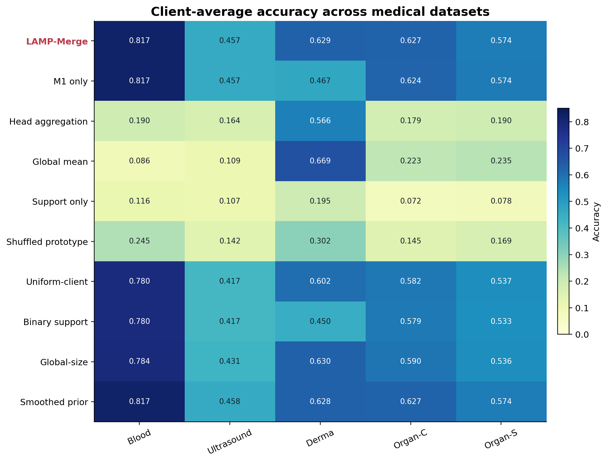
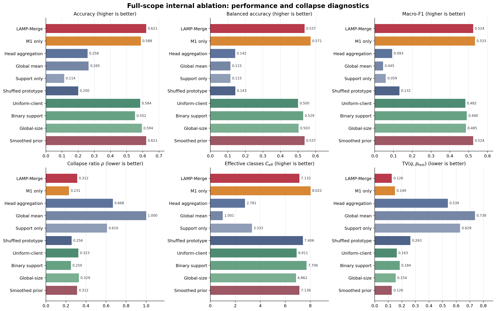
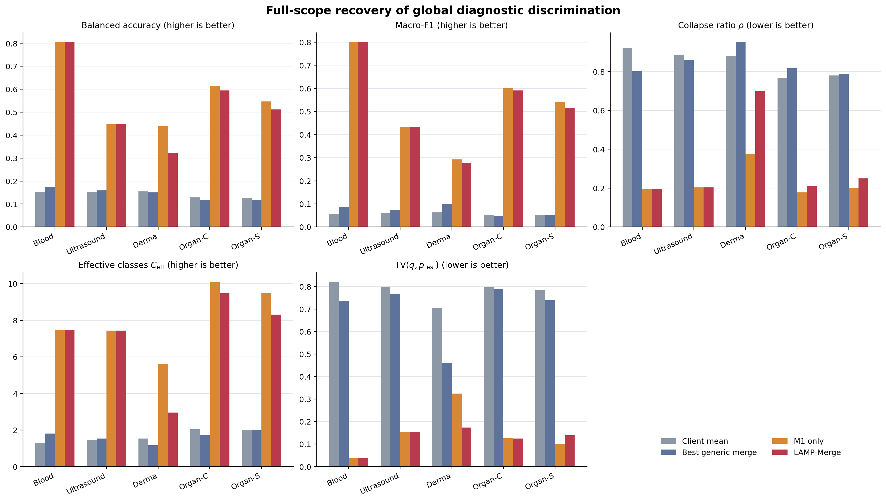
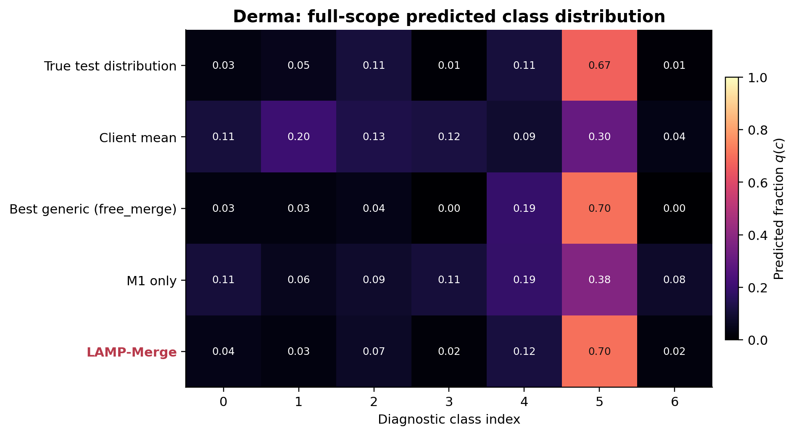
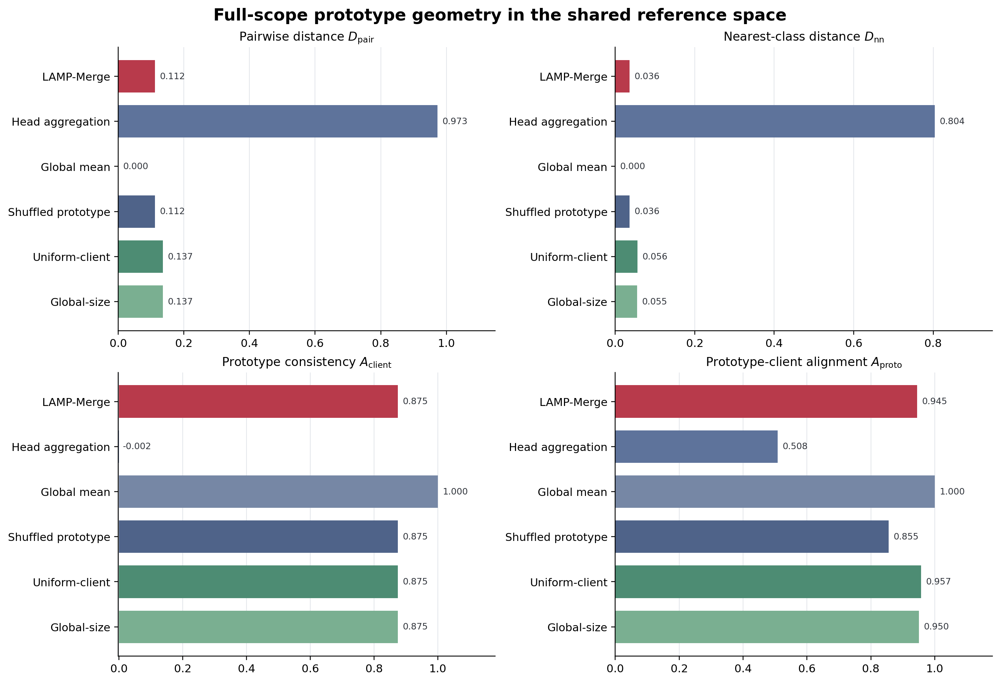
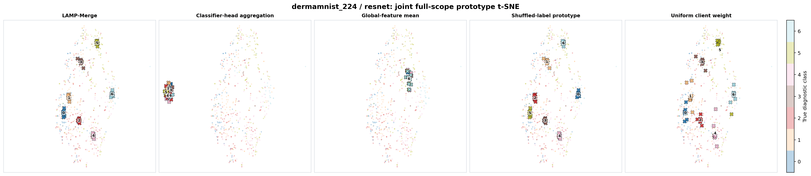
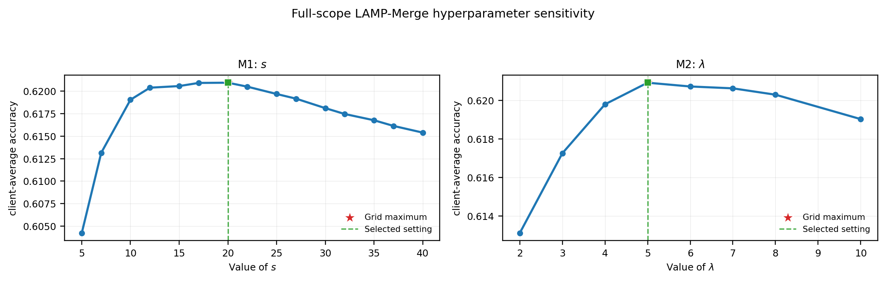

# LAMP-Merge 模块内补充消融汇报

本文档给出 LAMP-Merge 的最终模块级消融、模块内消融、预测坍缩诊断、原型几何分析、联合 t-SNE 可视化与超参数敏感性结果。所有定量结论均采用与正式主表一致的实验网格：5 个医学图像数据集、4 个 backbone、3 个客户端数量和 3 个 Dirichlet $\beta$ 设置。因而，每个方法包含 180 个 raw cells；对固定 `(dataset, backbone, K)` 下的三个 $\beta$ 取均值后，得到 60 个 client-average cells。本文档不引用任何单一数据集、单一 backbone 或单一 $\beta$ 的阶段性结果。

## 一、实验口径与符号

正式 LAMP-Merge 结果来自 `outputs/lamp_merge_full_client_local_20260708_193654`，模块内消融来自 `outputs/lamp_merge_internal_ablation_full_20260708_force_all_analysis_after_client_stats_internal_ablation`。所有分支均读取同一客户端统计目录 `outputs/lamp_merge_client_local_proto_stats`，并固定使用 $\gamma=0.45$、$s=20$、$\tau=2.5$ 与 $\lambda=5.0$。

| 符号 | 定义 |
|---|---|
| $K$ | 客户端数量 |
| $C$ | 诊断类别数量 |
| $D_i$ | 客户端 $i$ 的本地训练集 |
| $D_{i,c}$ | $D_i$ 中属于类别 $c$ 的样本集合 |
| $n_{i,c}$ | M1 的类别原型支持数，即 $|D_{i,c}|$ |
| $m_{i,c}$ | M2 的类别患病率计数 |
| $\phi_0$ | 所有客户端与服务端共享的参考骨干 |
| $T$ | 与模型输入一致的图像预处理 |
| $\mu_{i,c}$ | 客户端 $i$ 在共享参考空间中计算的类别 $c$ 原型 |
| $e_{i,c}$、$\alpha_{i,c}$ | 类别证据及其归一化客户端权重 |
| $p_c$、$w_c$ | 服务端聚合的全局诊断原型及原型分类头 |
| $\pi_c$ | 由客户端患病率计数估计的全局类别先验 |
| $r$、$\tau$ | 主导类不平衡强度及 M2 触发阈值 |
| $s$、$\lambda$ | 原型分类头尺度及长尾校准强度 |
| $b_c$ | M2 的中心化 log-prior bias |
| $q(c)$、$\rho$、$C_{\mathrm{eff}}$ | 预测类别分布、坍缩强度及有效预测类别数 |

### 1.1 M1：诊断原型重建

客户端 $i$ 在本地使用共享参考骨干计算类别原型：

```math
n_{i,c}=|D_{i,c}|,
\qquad
\mu_{i,c}
=
\frac{1}{n_{i,c}}
\sum_{(x,y)\in D_{i,c}}\phi_0(T(x)).
```

服务端将类别支持数映射为次线性证据权重：

```math
e_{i,c}
=
(n_{i,c}+1)^\gamma\mathbf{1}[n_{i,c}>0],
\qquad
\alpha_{i,c}
=
\frac{e_{i,c}}{\sum_{j=1}^{K}e_{j,c}}.
```

随后重建全局诊断原型和分类头：

```math
p_c
=
\sum_{i=1}^{K}\alpha_{i,c}\mu_{i,c},
\qquad
w_c
=
s\frac{p_c}{\|p_c\|_2}.
```

其中，$\gamma=0.45$ 抑制大客户端对单个类别的垄断，$s=20$ 将归一化原型映射到稳定的分类 logit 尺度。

### 1.2 M2：长尾患病率校准

客户端上传本地类别患病率计数 $m_{i,c}$，服务端估计全局类别先验与主导类不平衡强度：

```math
\pi_c
=
\frac{\sum_{i=1}^{K}m_{i,c}}
{\sum_{k=1}^{C}\sum_{i=1}^{K}m_{i,k}},
\qquad
r=C\max_c\pi_c.
```

当且仅当 $r>\tau$ 时，M2 引入中心化 log-prior：

```math
b_c
=
\mathbf{1}[r>\tau]\lambda
\left(
\log\pi_c
-
\frac{1}{C}\sum_{k=1}^{C}\log\pi_k
\right).
```

最终分类分数为：

```math
\operatorname{score}_c(x)
=
w_c^\top\phi_0(T(x))+b_c.
```

M1 决定类别判别方向，M2 只在检测到强长尾时调整类别间相对偏置。服务端融合阶段不接收原始图像、逐样本特征或逐样本预测。

## 二、模块内消融设计

消融实验以最终 LAMP-Merge 为唯一参照，不以 `avg` 作为模块有效性的判据。实验分为原型信息替代和类别统计信息替代两组。

| 设置 | 替换内容 | 检验问题 |
|---|---|---|
| M1 only | 令 $b_c=0$ | M2 是否提供额外长尾收益 |
| Classifier-head aggregation | 以客户端本地分类头代替 $\mu_{i,c}$ | 本地训练后的分类头能否替代共享参考原型 |
| Global-feature mean | 所有类别共享同一全局特征均值 | 类别条件信息是否必要 |
| Support-only synthetic head | 用固定随机单位方向代替类别原型 | 类别计数本身是否足以恢复判别方向 |
| Shuffled-label prototype | 随机置换 $p_c$ 与类别标签的对应关系 | 收益是否依赖正确诊断语义 |
| Uniform client weight | 出现类别的客户端等权聚合 | 支持数大小是否提供可靠性信息 |
| Binary support only | 原型聚合和先验估计均只使用类别是否出现 | 细粒度计数是否优于二值类别存在性 |
| Global client-size weight | 用客户端总样本数 $N_i$ 代替 $n_{i,c}$ | 类别级支持是否优于客户端级规模 |
| No prevalence calibration | 令 $b_c=0$ | 患病率校准是否必要 |
| Uniform prevalence prior | 令 $\pi_c=1/C$ | M2 收益是否来自真实患病率 |
| Smoothed prevalence prior | 对 $m_{i,c}$ 施加加性平滑 | M2 是否对计数扰动稳定 |

原型信息替代分别定义为：

```math
p_c^{\mathrm{head}}
=
\sum_{i=1}^{K}\alpha_{i,c}h_{i,c},
\qquad
p_c^{\mathrm{global}}=g,
\qquad
p_c^{\mathrm{sup}}=u_c,
\qquad
p_c^{\mathrm{shuf}}=p_{\sigma(c)}.
```

其中，$h_{i,c}$ 是客户端 $i$ 的本地分类头方向，$g$ 是类别无关的全局特征均值，$u_c$ 是固定随机单位向量，$\sigma$ 是类别标签的随机置换。

类别统计替代分别定义为：

```math
\alpha_{i,c}^{\mathrm{uni}}
=
\frac{\mathbf{1}[n_{i,c}>0]}
{\sum_{j=1}^{K}\mathbf{1}[n_{j,c}>0]},
```

```math
\pi_c^{\mathrm{bin}}
=
\frac{\sum_{i=1}^{K}\mathbf{1}[n_{i,c}>0]}
{\sum_{k=1}^{C}\sum_{i=1}^{K}\mathbf{1}[n_{i,k}>0]},
```

```math
\alpha_{i,c}^{\mathrm{size}}
=
\frac{N_i\mathbf{1}[n_{i,c}>0]}
{\sum_{j=1}^{K}N_j\mathbf{1}[n_{j,c}>0]},
\qquad
N_i=\sum_{c=1}^{C}n_{i,c},
```

```math
\pi_c^{\mathrm{smooth}}
=
\frac{\sum_{i=1}^{K}(m_{i,c}+\delta)}
{\sum_{k=1}^{C}\sum_{i=1}^{K}(m_{i,k}+\delta)},
\qquad
\delta=1.
```

除被替换的量外，其余公式与正式方法完全一致。

## 三、全量 Accuracy 消融

### 3.1 总体结果

| 设置 | Raw cells | Client-average mean Acc | Mean margin vs LAMP | Client-average $\ge$ LAMP |
|---|---:|---:|---:|---:|
| LAMP-Merge | 180 | 0.6209 | 0.0000 | 60/60 |
| M1 only | 180 | 0.5880 | -0.0329 | 30/60 |
| Classifier-head aggregation | 180 | 0.2579 | -0.3630 | 2/60 |
| Global-feature mean | 180 | 0.2645 | -0.3564 | 9/60 |
| Support-only synthetic head | 180 | 0.1137 | -0.5073 | 0/60 |
| Shuffled-label prototype | 180 | 0.2002 | -0.4207 | 0/60 |
| Uniform client weight | 180 | 0.5839 | -0.0370 | 3/60 |
| Binary support only | 180 | 0.5517 | -0.0692 | 2/60 |
| Global client-size weight | 180 | 0.5944 | -0.0266 | 5/60 |
| No prevalence calibration | 180 | 0.5879 | -0.0330 | 24/60 |
| Uniform prevalence prior | 180 | 0.5879 | -0.0330 | 24/60 |
| Smoothed prevalence prior | 180 | 0.6209 | -0.0000 | 39/60 |

诊断原型替代项均显著低于正式方法，说明性能收益不能由额外分类头、随机方向或类别计数本身解释。`No prevalence calibration` 与 M1-only 在判别函数上等价，`Uniform prevalence prior` 的中心化 log-prior 也恒为零；三者之间小于 $5\times10^{-5}$ 的均值差异来自独立评估过程的浮点数值误差。加性平滑先验与正式方法仅相差 $7.8\times10^{-6}$，表明 M2 对轻微计数扰动稳定。

### 3.2 数据集级结果

原型信息消融如下：

| Dataset | LAMP-Merge | M1 only | Head aggregation | Global mean | Support only | Shuffled prototype |
|---|---:|---:|---:|---:|---:|---:|
| bloodmnist_224 | 0.8174 | 0.8174 | 0.1897 | 0.0864 | 0.1162 | 0.2446 |
| chaoshengmnist_224 | 0.4574 | 0.4574 | 0.1642 | 0.1087 | 0.1069 | 0.1416 |
| dermamnist_224 | 0.6286 | 0.4666 | 0.5665 | 0.6688 | 0.1953 | 0.3015 |
| organcmnist_224 | 0.6270 | 0.6240 | 0.1791 | 0.2233 | 0.0715 | 0.1447 |
| organsmnist_224 | 0.5741 | 0.5745 | 0.1902 | 0.2354 | 0.0784 | 0.1685 |

类别统计信息消融如下：

| Dataset | LAMP-Merge | Uniform-client | Binary support | Global-size | No prevalence | Uniform prior | Smoothed prior |
|---|---:|---:|---:|---:|---:|---:|---:|
| bloodmnist_224 | 0.8174 | 0.7803 | 0.7803 | 0.7845 | 0.8174 | 0.8174 | 0.8174 |
| chaoshengmnist_224 | 0.4574 | 0.4174 | 0.4174 | 0.4313 | 0.4575 | 0.4575 | 0.4575 |
| dermamnist_224 | 0.6286 | 0.6025 | 0.4499 | 0.6300 | 0.4664 | 0.4664 | 0.6283 |
| organcmnist_224 | 0.6270 | 0.5825 | 0.5786 | 0.5899 | 0.6240 | 0.6240 | 0.6272 |
| organsmnist_224 | 0.5741 | 0.5370 | 0.5325 | 0.5361 | 0.5744 | 0.5744 | 0.5742 |



每个单元格均为 12 个 client-average cells 的均值，覆盖 4 个 backbone 与 3 个客户端数量。`Global-feature mean` 在 Derma 上取得 0.6688 的 Accuracy，但后续诊断显示其坍缩强度接近 1、Balanced Accuracy 仅约 0.14；该现象说明强长尾医学数据上的高 Accuracy 可能由单类预测产生，不能作为完整判别能力的唯一证据。

## 四、预测坍缩与非 Accuracy 指标

### 4.1 指标定义

设测试集包含 $N$ 个样本，模型预测为 $\hat{y}_n$。预测类别分布定义为：

```math
q(c)
=
\frac{1}{N}
\sum_{n=1}^{N}\mathbf{1}[\hat{y}_n=c].
```

预测坍缩强度和有效预测类别数定义为：

```math
\rho=\max_c q(c),
\qquad
C_{\mathrm{eff}}
=
\exp\left(-\sum_{c=1}^{C}q(c)\log q(c)\right).
```

$\rho$ 越接近 1，模型越接近单类预测器；$C_{\mathrm{eff}}$ 越大，模型实际使用的诊断类别越充分。Balanced Accuracy、Macro-F1 和预测分布总变差分别为：

```math
\operatorname{BA}
=
\frac{1}{C}\sum_{c=1}^{C}\operatorname{Recall}_c,
\qquad
\operatorname{MacroF1}
=
\frac{1}{C}\sum_{c=1}^{C}\operatorname{F1}_c,
```

```math
\operatorname{TV}(q,p_{\mathrm{test}})
=
\frac{1}{2}\sum_{c=1}^{C}
|q(c)-p_{\mathrm{test}}(c)|.
```

其中，$p_{\mathrm{test}}$ 是测试集真实类别分布。五个测试集均覆盖全部 $C$ 个类别，因此上述宏平均与对测试集中有效类别求平均等价。

预测诊断共包含 5400 条模型评测记录，全部为 `status=OK`。每个非客户端方法包含 180 个 full-scope cases；客户端结果先在同一 `(dataset, backbone, K, beta)` 内对客户端取均值，再在数据集内聚合，避免客户端数量对均值产生额外权重。

### 4.2 模块内诊断结果

下表仅报告非 Accuracy 指标；Accuracy 以第三节的正式消融结果为准。

| 设置 | BA $\uparrow$ | Macro-F1 $\uparrow$ | $\rho$ $\downarrow$ | $C_{\mathrm{eff}}$ $\uparrow$ | Pred-True TV $\downarrow$ |
|---|---:|---:|---:|---:|---:|
| LAMP-Merge | 0.5370 | 0.5238 | 0.3122 | 7.1322 | 0.1262 |
| M1 only | 0.5713 | 0.5335 | 0.2311 | 8.0224 | 0.1490 |
| Classifier-head aggregation | 0.1420 | 0.0932 | 0.6679 | 2.7812 | 0.5386 |
| Global-feature mean | 0.1149 | 0.0448 | 0.9996 | 1.0015 | 0.7381 |
| Support-only synthetic head | 0.1147 | 0.0590 | 0.6099 | 3.3330 | 0.6287 |
| Shuffled-label prototype | 0.1425 | 0.1316 | 0.2564 | 7.4060 | 0.2630 |
| Uniform client weight | 0.5001 | 0.4821 | 0.3232 | 6.9106 | 0.1628 |
| Binary support only | 0.5294 | 0.4901 | 0.2496 | 7.7057 | 0.1840 |
| Global client-size weight | 0.5028 | 0.4852 | 0.3293 | 6.8625 | 0.1543 |
| Smoothed prevalence prior | 0.5371 | 0.5238 | 0.3120 | 7.1357 | 0.1261 |



M1-only 具有更高的 BA、Macro-F1 和 $C_{\mathrm{eff}}$，说明诊断原型直接恢复了多类别判别结构。LAMP-Merge 的总体 Accuracy 更高、Pred-True TV 更低，说明 M2 将预测分布校准到真实医学患病率。二者并不矛盾：M1 优化类别均衡判别，M2 在强长尾条件下优化与真实测试分布一致的总体风险。

### 4.3 数据集级坍缩诊断

`Best generic` 表示在每个数据集上按 full-scope mean Accuracy 选出的最强固定通用融合基线，仅用于分析，不参与 LAMP-Merge 的模型选择。

| Dataset | Setting | BA | Macro-F1 | $\rho$ | $C_{\mathrm{eff}}$ | Pred-True TV |
|---|---|---:|---:|---:|---:|---:|
| bloodmnist_224 | Best generic (`iso_c`) | 0.1730 | 0.0860 | 0.8020 | 1.8145 | 0.7348 |
| bloodmnist_224 | M1 only | 0.8058 | 0.8011 | 0.1958 | 7.4795 | 0.0394 |
| bloodmnist_224 | LAMP-Merge | 0.8058 | 0.8011 | 0.1958 | 7.4795 | 0.0394 |
| chaoshengmnist_224 | Best generic (`fisher`) | 0.1595 | 0.0753 | 0.8603 | 1.5414 | 0.7679 |
| chaoshengmnist_224 | M1 only | 0.4481 | 0.4329 | 0.2042 | 7.4419 | 0.1538 |
| chaoshengmnist_224 | LAMP-Merge | 0.4481 | 0.4329 | 0.2042 | 7.4419 | 0.1538 |
| dermamnist_224 | Best generic (`free_merge`) | 0.1504 | 0.0997 | 0.9522 | 1.1641 | 0.4606 |
| dermamnist_224 | M1 only | 0.4413 | 0.2922 | 0.3754 | 5.6120 | 0.3244 |
| dermamnist_224 | LAMP-Merge | 0.3242 | 0.2773 | 0.6995 | 2.9585 | 0.1737 |
| organcmnist_224 | Best generic (`robustmerge`) | 0.1194 | 0.0494 | 0.8174 | 1.7291 | 0.7870 |
| organcmnist_224 | M1 only | 0.6148 | 0.6014 | 0.1781 | 10.1125 | 0.1257 |
| organcmnist_224 | LAMP-Merge | 0.5951 | 0.5915 | 0.2115 | 9.4702 | 0.1250 |
| organsmnist_224 | Best generic (`robustmerge`) | 0.1193 | 0.0538 | 0.7888 | 1.9973 | 0.7385 |
| organsmnist_224 | M1 only | 0.5466 | 0.5398 | 0.2017 | 9.4662 | 0.1020 |
| organsmnist_224 | LAMP-Merge | 0.5118 | 0.5162 | 0.2499 | 8.3109 | 0.1389 |



在 Blood、Ultrasound、Organ-C 与 Organ-S 上，LAMP-Merge 和 M1-only 均将 $\rho$ 从通用融合基线的约 0.79--0.86 降至约 0.18--0.25，并显著提高 $C_{\mathrm{eff}}$。Derma 是 M2 的主要触发数据集：M1-only 的 $\rho=0.3754$，而 LAMP-Merge 根据真实患病率将其提高到 0.6995；该值仍显著低于最强通用基线的 0.9522，同时 Pred-True TV 从 0.3244 降至 0.1737。

### 4.4 预测分布可视化

下图在 Derma 的 36 个 full-scope cases 上聚合预测类别比例。测试集类别 5 的真实比例为 0.67；M1-only 的预测比例为 0.38，LAMP-Merge 经 M2 校准后为 0.70。相比之下，最强通用基线 `free_merge` 的坍缩强度为 0.9522。由此可见，M2 不是无约束地追随多数类，而是将 M1 的均衡预测分布校准到客户端上传计数所估计的真实长尾先验。

图中每个单元格先对 36 个 case 的预测分布 $q(c)$ 取均值；表 4.3 的坍缩强度则先在每个 case 内计算 $\rho=\max_c q(c)$，再对 $\rho$ 取均值。由于最大值算子是非线性的，`free_merge` 在图中平均分布的最大分量为 0.70，而其逐 case 坍缩强度均值为 0.9522；后者刻画单次融合结果发生单类坍缩的频率与强度。



其余数据集的同口径预测分布图如下：

| Dataset | Full-scope prediction distribution |
|---|---|
| bloodmnist_224 | [bloodmnist_224_prediction_distribution.png](figures/lamp_merge_internal_analysis/bloodmnist_224_prediction_distribution.png) |
| chaoshengmnist_224 | [chaoshengmnist_224_prediction_distribution.png](figures/lamp_merge_internal_analysis/chaoshengmnist_224_prediction_distribution.png) |
| dermamnist_224 | [dermamnist_224_prediction_distribution.png](figures/lamp_merge_internal_analysis/dermamnist_224_prediction_distribution.png) |
| organcmnist_224 | [organcmnist_224_prediction_distribution.png](figures/lamp_merge_internal_analysis/organcmnist_224_prediction_distribution.png) |
| organsmnist_224 | [organsmnist_224_prediction_distribution.png](figures/lamp_merge_internal_analysis/organsmnist_224_prediction_distribution.png) |

## 五、原型几何与联合 t-SNE

### 5.1 共享参考空间

所有原型均位于同一个共享参考特征空间：

```math
z=\phi_0(T(x)).
```

$\phi_0$ 由公开实验配置确定，不使用客户端私有图像训练。客户端只上传类别均值 $\mu_{i,c}$ 和类别计数；服务端在该公共坐标系中聚合 $p_c$。因此，不同客户端的同类原型具有可比较的语义方向。

令 $\bar{p}_c=p_c/\|p_c\|_2$，$\mathcal{I}_c=\{i:n_{i,c}>0\}$。平均类间距离与最近错误类距离定义为：

```math
D_{\mathrm{pair}}
=
\frac{1}{C(C-1)}
\sum_{c\ne d}
\left(1-\bar{p}_c^\top\bar{p}_d\right),
```

```math
D_{\mathrm{nn}}
=
\frac{1}{C}
\sum_{c=1}^{C}
\min_{d\ne c}
\left(1-\bar{p}_c^\top\bar{p}_d\right).
```

跨客户端同类原型一致性与全局原型对齐度定义为：

```math
A_{\mathrm{client}}
=
\frac{1}{|\Omega_{\mathrm{client}}|}
\sum_{(c,i,j)\in\Omega_{\mathrm{client}}}
\frac{\mu_{i,c}^\top\mu_{j,c}}
{\|\mu_{i,c}\|_2\|\mu_{j,c}\|_2},
```

```math
A_{\mathrm{proto}}
=
\frac{1}{|\Omega_{\mathrm{align}}|}
\sum_{(c,i)\in\Omega_{\mathrm{align}}}
\frac{p_c^\top\mu_{i,c}}
{\|p_c\|_2\|\mu_{i,c}\|_2}.
```

其中，$\Omega_{\mathrm{client}}=\{(c,i,j):i\ne j,\ i,j\in\mathcal{I}_c\}$，$\Omega_{\mathrm{align}}=\{(c,i):i\in\mathcal{I}_c\}$。Evidence entropy 衡量类别证据权重 $\alpha_{i,c}$ 是集中于高支持客户端还是趋于均匀：

```math
H_{\mathrm{evi}}
=
\frac{1}{C}
\sum_{c=1}^{C}
\frac{-\sum_{i\in\mathcal{I}_c}\alpha_{i,c}\log\alpha_{i,c}}
{\log\max(|\mathcal{I}_c|,2)}.
```

### 5.2 全量几何结果

| 设置 | Cases | $D_{\mathrm{pair}}$ | $D_{\mathrm{nn}}$ | $A_{\mathrm{client}}$ | $A_{\mathrm{proto}}$ | $H_{\mathrm{evi}}$ |
|---|---:|---:|---:|---:|---:|---:|
| LAMP-Merge | 180 | 0.1122 | 0.0361 | 0.8751 | 0.9446 | 0.2505 |
| Classifier-head aggregation | 180 | 0.9734 | 0.8041 | -0.0021 | 0.5079 | 0.2505 |
| Global-feature mean | 180 | 0.0000 | 0.0000 | 1.0000 | 1.0000 | 0.2505 |
| Support-only synthetic head | 180 | 0.9870 | 0.9141 | 1.0000 | 1.0000 | 0.2505 |
| Shuffled-label prototype | 180 | 0.1122 | 0.0361 | 0.8751 | 0.8554 | 0.2505 |
| Uniform client weight | 180 | 0.1365 | 0.0557 | 0.8751 | 0.9571 | 0.4126 |
| Binary support only | 180 | 0.1365 | 0.0557 | 0.8751 | 0.9571 | 0.4126 |
| Global client-size weight | 180 | 0.1369 | 0.0551 | 0.8751 | 0.9502 | 0.3399 |



几何指标必须联合解释。Classifier-head aggregation 的类间距离很大，但 $A_{\mathrm{client}}\approx0$，说明本地分类头并不位于稳定的跨客户端语义坐标系；Global-feature mean 和随机方向具有构造性的一致性，却不能形成与诊断类别对应的有效边界；Shuffled-label prototype 保留了原型间距离和同类一致性，但降低 $A_{\mathrm{proto}}$ 并显著损失 Accuracy。LAMP-Merge 的有效性因此来自“非零类别分离、跨客户端同类一致、正确类别语义对齐和支持数驱动的可靠性分配”的联合结构，而非最大化任一单独几何指标。

### 5.3 联合 t-SNE

t-SNE 仅用于论文分析，不参与服务端融合或模型选择。对每个 `(dataset, backbone)`，分析将该 backbone 的测试特征与 5 个方法在全部 9 个 `(K,\beta)` 设置下的类别原型放入同一次 t-SNE 拟合；五个子图共享同一二维坐标系，因此原型位置可以跨方法比较。20 张图覆盖 5 个数据集和 4 个 backbone。



完整联合 t-SNE 图位于 [full_scope_tsne_comparison](figures/lamp_merge_prototype_geometry/full_scope_tsne_comparison/)。图中的测试样本仅用于实验后可视化，不属于 LAMP-Merge 的服务端输入。

## 六、全量超参数敏感性

M1 的连续超参数是原型分类头尺度 $s$，M2 的连续超参数是长尾校准强度 $\lambda$。每个取值均在 180 个 raw cells 和 60 个 client-average cells 上评估。

| Module | Hyperparameter | Value | Client-average mean Acc |
|---|---|---:|---:|
| M1 | $s$ | 5 | 0.6042 |
| M1 | $s$ | 7 | 0.6131 |
| M1 | $s$ | 10 | 0.6190 |
| M1 | $s$ | 12 | 0.6204 |
| M1 | $s$ | 15 | 0.6206 |
| M1 | $s$ | 17 | 0.6209 |
| M1 | $s$ | 20 | 0.6209 |
| M1 | $s$ | 22 | 0.6205 |
| M1 | $s$ | 25 | 0.6197 |
| M1 | $s$ | 27 | 0.6192 |
| M1 | $s$ | 30 | 0.6181 |
| M1 | $s$ | 32 | 0.6175 |
| M1 | $s$ | 35 | 0.6168 |
| M1 | $s$ | 37 | 0.6161 |
| M1 | $s$ | 40 | 0.6154 |
| M2 | $\lambda$ | 2 | 0.6131 |
| M2 | $\lambda$ | 3 | 0.6173 |
| M2 | $\lambda$ | 4 | 0.6198 |
| M2 | $\lambda$ | 5 | 0.6209 |
| M2 | $\lambda$ | 6 | 0.6207 |
| M2 | $\lambda$ | 7 | 0.6206 |
| M2 | $\lambda$ | 8 | 0.6203 |
| M2 | $\lambda$ | 10 | 0.6190 |



$s\in[12,22]$ 时，平均 Accuracy 保持在 0.6204--0.6209；$\lambda\in[4,8]$ 时，平均 Accuracy 保持在 0.6198--0.6209。正式取值 $s=20$、$\lambda=5$ 均位于稳定平台内部，说明结果不依赖窄范围单点调参。

## 七、理论解释

令 $\mu_c^\star$ 表示类别 $c$ 在共享参考空间中的真实均值。若客户端类别特征独立且二阶矩有界，则聚合原型的均方误差满足：

```math
\mathbb{E}\|p_c-\mu_c^\star\|_2^2
\le
\sum_{i=1}^{K}
\alpha_{i,c}^2
\frac{\sigma_c^2}{n_{i,c}}
+
\operatorname{Bias}_c^2.
```

该上界说明，类别支持数 $n_{i,c}$ 直接控制原型估计方差；没有观察到类别 $c$ 的客户端不应参与该类别方向构造，具有更多同类样本的客户端应获得更高但次线性的权重。客户端总规模 $N_i$ 或二值类别存在性无法提供同等的类别级方差控制，这与对应消融退化一致。

设样本 $x$ 的参考特征为 $z=\phi_0(T(x))$，类别 $c$ 与 $d$ 的真实 margin 为：

```math
\Delta_{c,d}(x)
=
(\mu_c^\star)^\top z
-
(\mu_d^\star)^\top z.
```

若：

```math
\|p_c-\mu_c^\star\|_2
+
\|p_d-\mu_d^\star\|_2
<
\frac{\Delta_{c,d}(x)}{\|z\|_2},
```

则用聚合原型替代真实类别均值不会改变 $c$ 与 $d$ 的判别顺序。M1 通过降低类别原型估计误差来维持多类别 margin，从而抑制多数类方向吸收少数类方向。

当 M2 触发时，任意两个类别之间的先验 margin 改变量为：

```math
b_c-b_d
=
\lambda(\log\pi_c-\log\pi_d),
```

因此：

```math
|b_c-b_d|
\le
\lambda|\log\pi_c-\log\pi_d|.
```

有限的 $\lambda$ 保证 M2 是有界校准而非判别方向替代。实验上，M1-only 恢复类别覆盖；M2 主要在 Derma 的强长尾条件下调整预测分布，并将 Pred-True TV 从 0.3244 降至 0.1737。这与理论中的“原型负责判别、先验负责有限风险校准”一致。

## 八、结论

全量消融和诊断支持以下结论：

1. 共享参考空间中的类别原型 $\mu_{i,c}$ 与 $p_c$ 是恢复全局诊断判别的核心信息；本地分类头、类别无关均值、随机方向或标签错配原型均不能替代。
2. 类别支持数 $n_{i,c}$ 提供类别级原型可靠性，优于客户端总规模、等权客户端或二值类别存在性。
3. M1 显著降低预测坍缩并提高 BA、Macro-F1 与 $C_{\mathrm{eff}}$；M2 使用患病率计数 $m_{i,c}$ 在强长尾条件下提高总体 Accuracy 并降低 Pred-True TV。
4. 加性平滑先验与正式方法几乎等价，表明 M2 对轻微计数扰动稳定，而非依赖精确极端计数。
5. 几何分析与联合 t-SNE 共同说明，LAMP-Merge 的收益来自正确类别语义、跨客户端一致性和支持数驱动的可靠性聚合，而不是任一单独几何指标。

对应原始结果位于：

- `My_merge_ret/reports/lamp_merge_internal_ablation_full.csv`
- `My_merge_ret/reports/prediction_diagnostics_full.csv`
- `My_merge_ret/reports/lamp_merge_prototype_geometry_full.csv`
- `My_merge_ret/reports/lamp_merge_hparam_full.csv`
