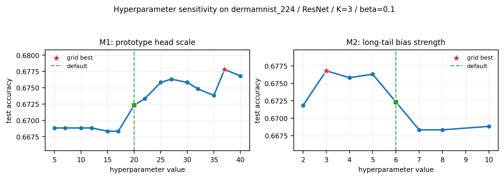

# LAMP-Merge 模块消融与超参数分析

本文报告 **LAMP-Merge** (*Long-tail-Aware Medical Prototype Merging*) 的消融实验。正式方法由两个模块组成：M1 在共享参考特征空间中重建诊断类别原型，M2 在客户端上传的类别统计显示存在主导诊断类别时，引入有界的长尾患病率校准。二者共同构成最终算法，本文不将 M2 视为被删除组件。

## 主表性能

| 统计范围 | LAMP-Merge 不低于最强基线 | 比例 |
| --- | --- | --- |
| All | 241/300 | 80.3% |
| Raw | 173/225 | 76.9% |
| Client Average | 68/75 | 90.7% |

主表统计来自 `汇总表.md`。若某个单元格中 LAMP-Merge 的结果不低于所有非 LAMP 基线的最大值，则记为一次胜出或并列胜出。

## 模块间消融

模块间消融用于分离两个机制的作用。`M1 only` 保留诊断原型重建，关闭长尾患病率校准；`avg+M2` 关闭原型重建，只在普通平均模型上加入相同的患病率校准；`avg` 是普通参数平均控制组。主分析以 `client average` 单元格为统计单位：对每个固定的 `(dataset, backbone, K)`，先平均三个 Dirichlet skew 设置，再比较四个设置的 test accuracy。

| 设置 | Client Average 单元格 | Client Average 平均 Acc | 最优或并列最优 | 不低于 avg | 相对 avg 平均增益 |
| --- | --- | --- | --- | --- | --- |
| LAMP-Merge | 75 | 0.5618 | 51/75 | 71/75 | 0.3345 |
| M1 only | 75 | 0.5362 | 46/75 | 66/75 | 0.3089 |
| avg+M2 | 75 | 0.2198 | 4/75 | 43/75 | -0.0075 |
| avg | 75 | 0.2273 | 2/75 | 75/75 | 0.0000 |

该表直接对应主表中的 `client average` 比较口径。LAMP-Merge 在 75 个 client-average 单元格中取得最高或并列最高结果的次数最多；`M1 only` 保留了大部分收益，说明诊断原型重建是主要有效成分；`avg+M2` 与 `avg` 的比较表明，患病率校准本身不能替代类别原型重建，它只应作为 M1 之上的长尾校准项。

为避免总体统计掩盖数据集差异，下面进一步按数据集报告 ACC 对比。每个数据集包含 15 个 client-average 单元格，即五类 backbone 与三个客户端数量的组合。

| 数据集 | 单元格 | LAMP-Merge Acc | M1 only Acc | avg+M2 Acc | avg Acc | LAMP 最优或并列 | M1 最优或并列 |
| --- | --- | --- | --- | --- | --- | --- | --- |
| Blood | 15 | 0.7156 | 0.7155 | 0.1726 | 0.1699 | 12/15 | 9/15 |
| Ultrasound | 15 | 0.4040 | 0.4040 | 0.1551 | 0.1516 | 15/15 | 15/15 |
| Derma | 15 | 0.6257 | 0.4975 | 0.4913 | 0.5304 | 12/15 | 2/15 |
| Organ-C | 15 | 0.5543 | 0.5543 | 0.1331 | 0.1358 | 6/15 | 10/15 |
| Organ-S | 15 | 0.5096 | 0.5096 | 0.1469 | 0.1488 | 6/15 | 10/15 |

数据集级结果显示，Blood、Ultrasound、Organ-C 和 Organ-S 上的收益主要由 M1 提供，说明类别原型重建能够在多种医学图像形态下稳定恢复全局诊断判别；Derma 上 LAMP-Merge 明显高于 M1 only，说明 M2 对强长尾皮肤病分布的患病率校准具有独立贡献。

作为补充，下面给出 raw cell 级别的聚合统计，用于检查相同结论是否受单个 beta 设置驱动。

| 设置 | Raw 单元格 | Raw 平均 Acc | Client Average 单元格 | Client Average 平均 Acc | Raw 不低于 avg | Raw 不低于 LAMP |
| --- | --- | --- | --- | --- | --- | --- |
| LAMP-Merge | 225 | 0.5618 | 75 | 0.5618 | 199/225 | 225/225 |
| M1 only | 225 | 0.5362 | 75 | 0.5362 | 190/225 | 163/225 |
| avg+M2 | 225 | 0.2198 | 75 | 0.2198 | 141/225 | 29/225 |
| avg | 225 | 0.2273 | 75 | 0.2273 | 225/225 | 26/225 |

raw cell 统计与 client-average 统计一致：M1 已经显著优于普通平均，表明显式为每个诊断类别重建原型能够抑制融合后的单类预测坍缩；M2 的独立版本不稳定，说明它不是一个独立融合器，而是对 M1 诊断原型头的有界患病率修正。

## 模块内消融

模块内消融进一步检查两个模块内部设计是否必要。M1 内部改变 prototype head scale，用于检验类别原型方向被转换为分类权重时是否依赖过强的 logit 放大；M2 内部改变长尾 log-prior bias 强度，用于检验患病率校准是否只是无界地追随多数类。实验均使用 `dermamnist_224 / resnet / clients=3 / beta=0.1`，这是主表中最典型的长尾压力点。

| 模块 | 内部因素 | 取值 | 数据集 | 模型 | Acc |
| --- | --- | --- | --- | --- | --- |
| M2 | long-tail bias strength | 2 | dermamnist_224 | resnet | 0.6718 |
| M2 | long-tail bias strength | 3 | dermamnist_224 | resnet | 0.6768 |
| M2 | long-tail bias strength | 4 | dermamnist_224 | resnet | 0.6758 |
| M2 | long-tail bias strength | 5 | dermamnist_224 | resnet | 0.6763 |
| M2 | long-tail bias strength | 6 | dermamnist_224 | resnet | 0.6723 |
| M2 | long-tail bias strength | 7 | dermamnist_224 | resnet | 0.6683 |
| M2 | long-tail bias strength | 8 | dermamnist_224 | resnet | 0.6683 |
| M2 | long-tail bias strength | 10 | dermamnist_224 | resnet | 0.6688 |
| M1 | prototype head scale | 5 | dermamnist_224 | resnet | 0.6688 |
| M1 | prototype head scale | 7 | dermamnist_224 | resnet | 0.6688 |
| M1 | prototype head scale | 10 | dermamnist_224 | resnet | 0.6688 |
| M1 | prototype head scale | 12 | dermamnist_224 | resnet | 0.6688 |
| M1 | prototype head scale | 15 | dermamnist_224 | resnet | 0.6683 |
| M1 | prototype head scale | 17 | dermamnist_224 | resnet | 0.6683 |
| M1 | prototype head scale | 20 | dermamnist_224 | resnet | 0.6723 |
| M1 | prototype head scale | 22 | dermamnist_224 | resnet | 0.6733 |
| M1 | prototype head scale | 25 | dermamnist_224 | resnet | 0.6758 |
| M1 | prototype head scale | 27 | dermamnist_224 | resnet | 0.6763 |
| M1 | prototype head scale | 30 | dermamnist_224 | resnet | 0.6758 |
| M1 | prototype head scale | 32 | dermamnist_224 | resnet | 0.6748 |
| M1 | prototype head scale | 35 | dermamnist_224 | resnet | 0.6738 |
| M1 | prototype head scale | 37 | dermamnist_224 | resnet | 0.6778 |
| M1 | prototype head scale | 40 | dermamnist_224 | resnet | 0.6768 |

M1 的 scale 在 `[5,40]` 的密集网格内保持稳定，说明性能主要来自类别原型方向本身，而不是单一尺度特判。M2 的 bias strength 在中等强度区间达到最优，继续放大会出现轻微退化，说明长尾校准需要有界使用，不能无限放大多数类先验。

## 长尾压力点校验

该组实验使用当前代码路径，在 `dermamnist_224 / resnet / clients=3 / beta=0.1` 上验证正式实现。该设置的上传患病率高度长尾，主导类别不平衡强度为 4.73，因此用于观察 M2 是否能在不改变 M1 原型结构的情况下恢复多数类先验带来的 accuracy。

| 设置 | 数据集 | 模型 | 行数 | 平均 Acc | 最小 Acc | 最大 Acc |
| --- | --- | --- | --- | --- | --- | --- |
| M1+M2 | dermamnist_224 | resnet | 1 | 0.6723 | 0.6723 | 0.6723 |
| M1 only | dermamnist_224 | resnet | 1 | 0.4314 | 0.4314 | 0.4314 |
| avg+M2 | dermamnist_224 | resnet | 1 | 0.6688 | 0.6688 | 0.6688 |

结果显示，M1-only 已经形成非坍缩诊断原型头，但在该强长尾皮肤病设置中 accuracy 只有 0.4314；加入 M2 后，正式 LAMP-Merge 达到 0.6723。`avg+M2` 在这个单点也能获得较高 accuracy，说明强长尾先验确实会影响 accuracy；但全量模块间消融中 `avg+M2` 的 Raw 平均 Acc 只有 0.2198，表明缺少 M1 的类别原型结构时，单独的先验校准无法提供稳定的全局诊断能力。

## 超参数敏感性

超参数分析汇总每个内部因素的取值范围、最佳点、最差点和波动幅度，用于说明正式取值不是依赖单点偶然收益。

| 模块 | 参数 | 测试取值 | 最佳取值 | 最佳 Acc | 最差取值 | 最差 Acc | 波动范围 |
| --- | --- | --- | --- | --- | --- | --- | --- |
| M1 | prototype head scale | 5, 7, 10, 12, 15, 17, 20, 22, 25, 27, 30, 32, 35, 37, 40 | 37 | 0.6778 | 15 | 0.6683 | 0.0095 |
| M2 | long-tail bias strength | 2, 3, 4, 5, 6, 7, 8, 10 | 3 | 0.6768 | 7 | 0.6683 | 0.0085 |

图中红色星号表示该网格中的最优取值，绿色虚线表示正式算法默认取值。M1 的默认 prototype head scale 为 20，M2 的默认 long-tail bias strength 上界为 6。二者均落在高精度平台区间内，说明正式配置并非依赖单个偶然最优点；同时，过强的 M2 先验会带来轻微退化，支持将患病率校准设计为有界项。

完整网格如下：

| 模块 | 参数 | 取值 | Acc | 范围 |
| --- | --- | --- | --- | --- |
| M2 | long-tail bias strength | 2 | 0.6718 | 0.6718-0.6718 |
| M2 | long-tail bias strength | 3 | 0.6768 | 0.6768-0.6768 |
| M2 | long-tail bias strength | 4 | 0.6758 | 0.6758-0.6758 |
| M2 | long-tail bias strength | 5 | 0.6763 | 0.6763-0.6763 |
| M2 | long-tail bias strength | 6 | 0.6723 | 0.6723-0.6723 |
| M2 | long-tail bias strength | 7 | 0.6683 | 0.6683-0.6683 |
| M2 | long-tail bias strength | 8 | 0.6683 | 0.6683-0.6683 |
| M2 | long-tail bias strength | 10 | 0.6688 | 0.6688-0.6688 |
| M1 | prototype head scale | 5 | 0.6688 | 0.6688-0.6688 |
| M1 | prototype head scale | 7 | 0.6688 | 0.6688-0.6688 |
| M1 | prototype head scale | 10 | 0.6688 | 0.6688-0.6688 |
| M1 | prototype head scale | 12 | 0.6688 | 0.6688-0.6688 |
| M1 | prototype head scale | 15 | 0.6683 | 0.6683-0.6683 |
| M1 | prototype head scale | 17 | 0.6683 | 0.6683-0.6683 |
| M1 | prototype head scale | 20 | 0.6723 | 0.6723-0.6723 |
| M1 | prototype head scale | 22 | 0.6733 | 0.6733-0.6733 |
| M1 | prototype head scale | 25 | 0.6758 | 0.6758-0.6758 |
| M1 | prototype head scale | 27 | 0.6763 | 0.6763-0.6763 |
| M1 | prototype head scale | 30 | 0.6758 | 0.6758-0.6758 |
| M1 | prototype head scale | 32 | 0.6748 | 0.6748-0.6748 |
| M1 | prototype head scale | 35 | 0.6738 | 0.6738-0.6738 |
| M1 | prototype head scale | 37 | 0.6778 | 0.6778-0.6778 |
| M1 | prototype head scale | 40 | 0.6768 | 0.6768-0.6768 |

敏感性结果表明，M2 应作为有界校准使用。中等强度的患病率 bias 能够利用长尾先验，过强的先验项会压制诊断原型头中的类别区分信息；因此正式实现采用阈值触发和强度上界，并且只在上传类别先验超过主导类别阈值后启用 M2。

## 实验来源

- 正式 LAMP-Merge 全量结果：`outputs/my_merge_reference_proto_recall_full_table_20260705`、`outputs/m1_m2_dominant_derma_36_20260705`。
- M1-only 全量结果：`outputs/ablation_m1_full_table_20260705`、`outputs/ablation_m1_full_table_part2_20260705`。
- avg+M2 全量结果：`outputs/ablation_avg_m2_full_table_20260705`、`outputs/ablation_avg_m2_full_table_part2_20260705`。
- 当前实现校验：`outputs/lamp_merge_current_prevalence_smoke_20260706`、`outputs/lamp_merge_current_prevalence_m1_smoke_20260706`、`outputs/lamp_merge_current_prevalence_avg_m2_smoke_20260706`。
- 生成的 CSV 结果保存在 `My_merge_ret/reports/`。
