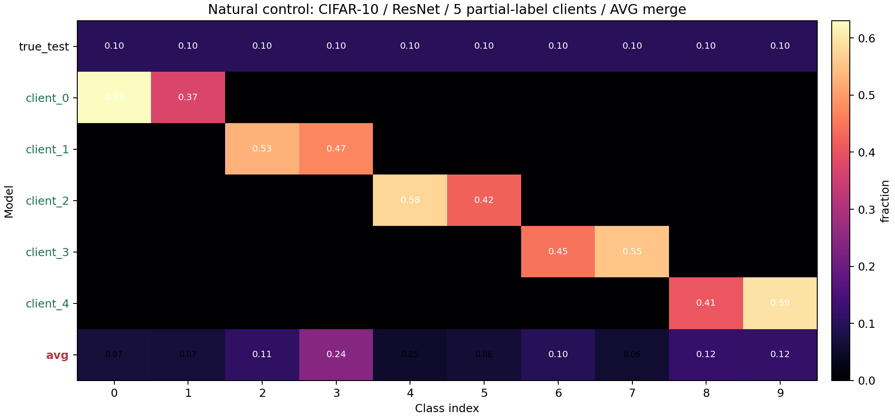
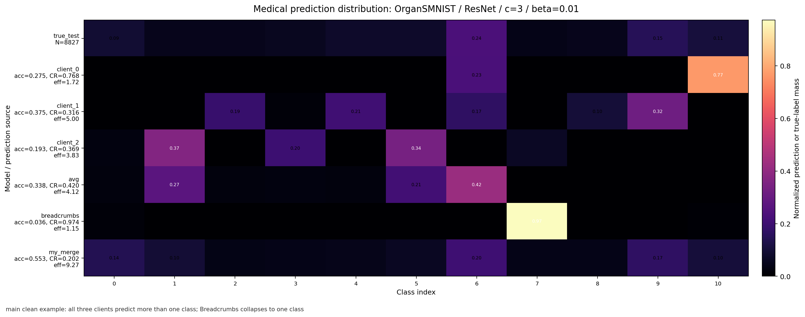
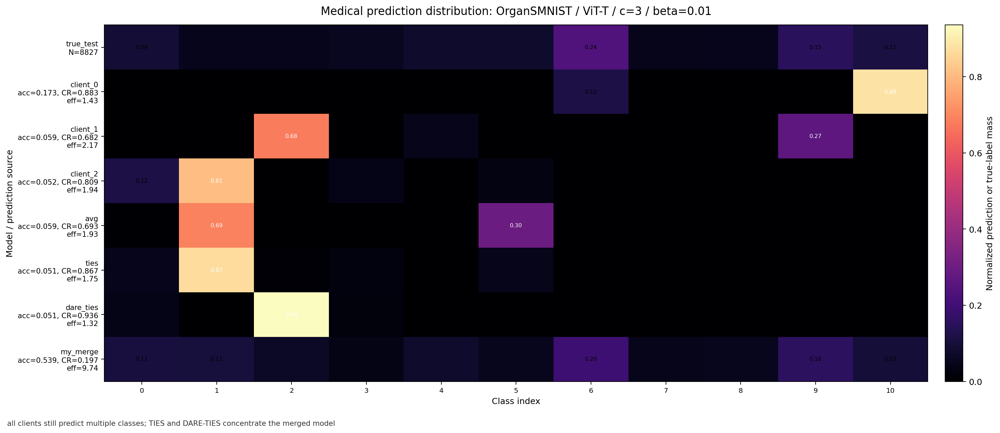
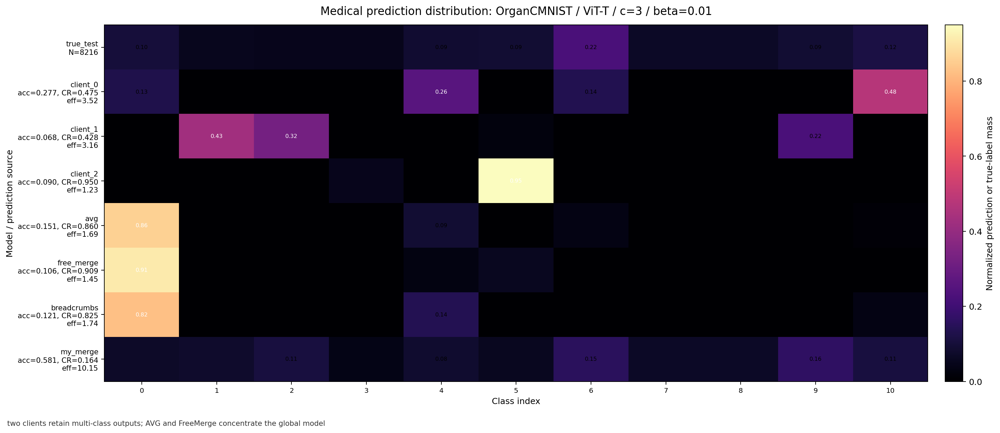
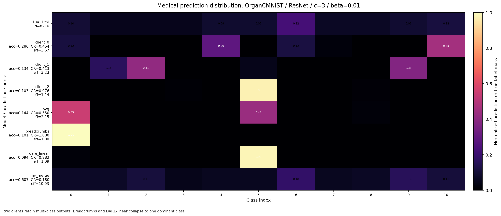

# LAMP-Merge 预测坍缩分析实验结果总结

本文件只汇总可用于论文或组会汇报的结果、表格、图和指标解释。实验流程、运行命令和实现细节见其他说明文档。

## 一、核心结论

在 5 个医学图像数据集、4 个 backbone、固定 `clients=3`、`beta=0.01`、`seed=42` 的 20 个 case 上，通用模型融合方法普遍出现预测坍缩：模型大量输出少数类别，导致 accuracy 偶尔被多数类抬高，但 balanced accuracy 和 macro F1 很低。

`LAMP-Merge` 的主要结果如下：

| 指标 | LAMP-Merge | 最强非 LAMP-Merge | 差值 | 结论 |
|---|---:|---:|---:|---|
| Accuracy ↑ | 0.5885 | 0.3156 (`client_best`) | +0.2729 | 总体准确率显著更高 |
| Balanced Accuracy ↑ | 0.5747 | 0.1810 (`client_best`) | +0.3937 | 对长尾类别更稳定 |
| Macro F1 ↑ | 0.5352 | 0.1123 (`client_best`) | +0.4229 | 多类别诊断能力明显更好 |
| Collapse Ratio ↓ | 0.2294 | 0.7477 (`ties`) | -0.5184 | 坍缩显著降低 |
| Effective Classes ↑ | 8.0390 | 2.1360 (`ties`) | +5.9030 | 实际使用类别数大幅增加 |
| Pred-True TV ↓ | 0.1510 | 0.6168 (`client_best`) | -0.4658 | 预测分布更接近真实类别分布 |

总体图：


## 二、坍缩现象链条

这一组分析用于支撑论文中的方法动机：医学图像模型融合的主要失效模式不是普通的 accuracy 波动，而是后置参数融合诱发的输出分布退化。基于该现象，M1 以客户端诊断原型保留类别级判别信息，并在服务端按类别重建全局判别头；M2 则在长尾患病率很强时加入有界类别先验，使非坍缩诊断头仍能利用真实医学类别比例。

在正式实验表格之前，我们先给出两个来自预测分布诊断的经验观测。

**观测 1：后置融合诱发预测坍缩（Aggregation-induced Predictive Collapse）。**

**核心观察：在局部类别覆盖的医学多中心设置中，后置参数融合会将多个非退化客户端预测器聚合成预测分布高度集中的全局坍缩模型。**

为刻画该现象，本文首先统计模型在测试集上的预测类别分布：

```math
q(c)=\frac{1}{N}\sum_{n=1}^{N}\mathbf{1}\left[\hat{y}_n=c\right].
```

其中，N 表示测试图像数量，c 表示诊断类别，q(c) 表示模型将测试图像预测为类别 c 的比例。进一步定义预测坍缩强度为：

```math
\rho=\max_c q(c).
```

ρ 是预测分布中的最大类别占比；ρ 越接近 1，模型越接近单一类别预测器。

具体而言，在多中心医学图像任务中，每个客户端通常只观测到全局诊断空间的一个子集，因此本地模型不可避免地带有类别偏置。但这种偏置并不意味着客户端模型已经退化为单类预测器：融合前的本地模型仍可对多个诊断类别产生有效响应。退化主要出现在后置融合阶段。现有参数级融合方法以模型整体为单位进行平均、裁剪或符号聚合，缺乏对“客户端在哪些诊断类别上具有可靠判别能力”的显式刻画。因此，原本局部且可控的类别偏置在全局参数空间中被叠加和放大，最终形成融合模型的单类或少数类预测坍缩。

以 OrgansMNIST-224、ResNet、3 clients、beta=0.01 为例，三个客户端的 ρ 分别为 0.7683、0.3161 和 0.3686，说明本地模型虽具有不同程度的类别偏置，但并未全部退化为单类输出。在相同设置下，Breadcrumbs 融合模型的 ρ 达到 0.9738，预测几乎集中到单一诊断类别。该结果说明，预测坍缩并非简单继承自已经失效的客户端模型，而是由类别无关的融合过程进一步诱发。

该观察直接引出 M1：后置融合不应只在参数空间中混合分类头，而应显式保存客户端仍然有效的类别级诊断知识。为此，M1 要求客户端上传每个诊断类别的特征原型，并以诊断原型作为本地判别能力的结构化载体。

**观测 2：长尾先验下的坍缩收益（Collapse Benefit under Long-tailed Priors）。**

**核心观察：在长尾医学类别先验下，多数类预测坍缩可以在 Accuracy 上形成表观正收益，其可达到的准确率由最高频类别先验直接决定。**

医学图像分类通常继承真实临床流行率或采样流行率，因而常见病、常见器官或高频诊断类别可能在测试集中占据较高比例。设测试集中最高频类别的占比为：

```math
p_{\max}=\max_c P(y=c).
```

如果一个模型完全坍缩到这个最高频类别，那么它虽然没有真正的多类别诊断能力，但仍可以得到如下 accuracy：

```math
\mathrm{Acc}_{\mathrm{collapse}}=p_{\max}.
```

因此，当最高频类别占比较大时，单类预测器可以在没有多类别诊断能力的情况下获得较高 accuracy。换言之，在长尾医学数据上，accuracy 可能将多数类坍缩误判为有效融合。这一现象解释了部分基线方法虽然预测分布高度集中，却仍能获得较高 accuracy 的原因。

该观察引出 M2：消除坍缩并不等价于强制预测分布均匀化，因为医学数据中的长尾先验具有真实统计含义；同时，模型也不能退化为多数类预测器。M2 因此不改变 M1 已经重建出的诊断原型，而是在客户端上传的患病率计数显示存在强主导类别时，对分类分数加入有界的中心化 log-prior。这样既保留每个诊断类别的独立判别方向，又允许真实高频类别获得必要的 accuracy 校准。

| 证据 | 数据与方法 | cases | acc | balanced acc | macro F1 | collapse ratio ↓ | effective classes ↑ | pred-true TV ↓ | 结论 |
|---|---|---:|---:|---:|---:|---:|---:|---:|---|
| 医学图像坍缩 | 5 个医学数据集 × 4 backbone，所有通用融合基线，不含 LAMP-Merge | 240 | 0.2047 | 0.1535 | 0.0727 | 0.7993 | 1.8600 | 0.7227 | 通用融合平均只使用约 1.86 个有效类别，明显坍缩 |
| 医学 AVG 坍缩 | 同一正式医学设置，仅 AVG | 20 | 0.2304 | 0.1543 | 0.0751 | 0.8028 | 1.7666 | 0.7082 | 最常用权重平均同样坍缩 |
| 自然图像不单类坍缩 | CIFAR-10 partial-label control，类别支持均衡，AVG | 1 | 0.1621 | 0.1621 | 0.1569 | 0.2425 | 10.0000 | - | 融合模型较弱，但仍预测全部 10 类，没有医学式单类坍缩 |
| 加 M1 后医学图像不坍缩 | 正式医学 20 case，M1 only，关闭 M2 | 20 | 0.5884 | 0.5746 | 0.5352 | 0.2294 | 8.0383 | 0.1510 | 类别原型头直接恢复多类别输出 |
| 加 M1+M2 后依旧不坍缩 | 正式医学 20 case，当前 LAMP-Merge | 20 | 0.5885 | 0.5747 | 0.5352 | 0.2294 | 8.0390 | 0.1510 | 长尾患病率校准没有重新引入坍缩 |


该图汇总了预测坍缩的三类证据：

- 医学图像坍缩：通用融合基线的 `collapse ratio=0.7993`，`effective classes=1.8600`，表明预测质量集中于极少数类别。
- 自然图像不单类坍缩：在 balanced CIFAR-10 partial-label control 中，AVG 的 `collapse ratio=0.2425`，并且 `effective classes=10.0000`。这表明相同的 post-hoc AVG 融合在自然图像控制实验中不会自然退化为医学图像中的单类输出。
- M1/M2 有效：M1 only 将 `collapse ratio` 从医学基线的 `0.7993` 降至 `0.2294`；加入 M2 后仍保持 `0.2294`。该结果表明，M2 的长尾患病率校准并未重新引入多数类坍缩。

自然图像对照的预测分布图如下：



该图来自自然图像对照实验。实验设置为：数据集 `cifar10_32`，测试集为 CIFAR-10 标准 test split；模型为 `resnet`；客户端数量为 5；每个客户端只训练两个类别，类别划分为 `[0,1]`、`[2,3]`、`[4,5]`、`[6,7]`、`[8,9]`；训练轮数为 8；随机种子为 42。融合算法为 post-hoc `avg` 权重平均，即直接对 5 个客户端模型参数做平均后在 CIFAR-10 test split 上评估。

图中 `true_test` 表示测试集真实类别分布，每个类别均为 0.10；`client_0` 到 `client_4` 表示单客户端模型的预测分布，它们主要输出各自见过的局部类别；`avg` 表示 AVG 融合模型的预测分布。AVG 融合后的分类性能有限，但 10 个类别均被预测到，`collapse ratio=0.2425`，`effective classes=10.0000`。因此，自然图像对照中的主要问题是弱分类性能，而不是退化到单个诊断类别的输出坍缩。

医学图像中，客户端与融合后算法的预测分布图如下。所有图均来自正式医学诊断设置：测试集为对应 MedMNIST 医学数据集 test split，客户端数量为 3，Dirichlet 非独立同分布参数 `beta=0.01`，随机种子为 42；每一行是一个模型在同一测试集上的预测类别分布，颜色越亮表示该模型越倾向输出该类别。



第一组证据采用 `organsmnist_224`、`resnet`、`clients=3`、`beta=0.01`、`seed=42`。三个客户端并未表现为严格单类输出：`client_0` 的 effective classes 为 1.72，`client_1` 为 5.00，`client_2` 为 3.83。这表明单客户端虽存在局部类别偏置，但仍保留多个诊断类别的预测能力。融合后，`breadcrumbs` 的 `collapse ratio=0.9738`，effective classes 仅为 1.15，预测几乎集中到单一类别；相同设置下 `LAMP-Merge` 的 `collapse ratio=0.2023`，effective classes 为 9.27，恢复了多类别诊断输出。



第二组证据使用同一医学数据集并替换为 `vit_t` backbone。三个客户端仍预测多个类别，effective classes 分别为 1.43、2.17、1.94；通用融合中的 `ties` 和 `dare_ties` 将预测进一步集中，`dare_ties` 的 `collapse ratio=0.9358`、effective classes 为 1.32。`LAMP-Merge` 在同一测试集上将 `collapse ratio` 降至 0.1966，并将 effective classes 提升至 9.74。该现象表明，预测坍缩并非 ResNet 特有问题，而会跨 backbone 出现。



第三组证据采用 `organcmnist_224`、`vit_t`。其中 `client_0` 和 `client_1` 仍保留多类输出，effective classes 分别为 3.52 和 3.16；`client_2` 存在更强的局部类别偏置。融合后，`avg`、`free_merge` 和 `breadcrumbs` 将全局模型进一步压缩到单个主导类别，其中 `free_merge` 的 `collapse ratio=0.9090`、effective classes 为 1.45。`LAMP-Merge` 的 `collapse ratio=0.1638`，effective classes 为 10.15。



第四组证据采用 `organcmnist_224`、`resnet`。`client_0` 和 `client_1` 的 effective classes 分别为 3.67 和 3.23，表明本地模型仍在多个类别之间进行判别；`breadcrumbs` 融合后退化为严格单类输出，`collapse ratio=1.0000`、effective classes 为 1.00，`dare_linear` 也接近单类输出，`collapse ratio=0.9825`。`LAMP-Merge` 在同一设置下维持 `collapse ratio=0.1804`、effective classes 为 10.03。

以上结果支持如下医学坍缩链条：客户端模型受到长尾分布和局部类别缺失影响，但仍保留多个医学类别的判别能力；通用 post-hoc 参数融合会将局部类别偏置放大为全局单类或少数类坍缩；`LAMP-Merge` 的类别原型机制将输出层约束回多类别诊断空间。

相关文件：

- 坍缩证据链 CSV：[my_merge_collapse_story_summary.csv](reports/my_merge_collapse_story_summary.csv)
- 医学 client-vs-merge 坍缩案例 CSV：[medical_client_vs_merge_collapse_examples.csv](reports/medical_client_vs_merge_collapse_examples.csv)
- M1-only 诊断 CSV：[prediction_diagnostics_m1_only_4models_c3_b001.csv](reports/prediction_diagnostics_m1_only_4models_c3_b001.csv)
- M1-only 按数据集汇总：[prediction_diagnostics_dataset_summary.md](reports/prediction_diagnostics_m1_only_4models_c3_b001/prediction_diagnostics_dataset_summary.md)
- 自然图像对照：[natural_collapse_summary.md](../medmerge_empirical_study/results/experiment9_natural_image_collapse_probe/natural_collapse_summary.md)

## 三、指标说明

| 指标 | 含义 | 方向 | 为什么重要 |
|---|---|---:|---|
| Accuracy | 总体分类正确率 | 越高越好 | 常规主指标，但在医学长尾数据上容易被多数类虚高影响 |
| Balanced Accuracy | 各真实类别召回率的平均值 | 越高越好 | 能反映少数类是否被保留，是证明“非坍缩”的关键指标 |
| Macro F1 | 各类别 F1 的平均值 | 越高越好 | 同时考虑各类别 precision 和 recall，适合多类别诊断 |
| Collapse Ratio | 预测最多类别所占测试样本比例 | 越低越好 | 直接衡量模型是否坍缩到单个或少数类别 |
| Effective Classes | 预测类别分布熵的指数 | 越高越好 | 表示模型实际使用了多少个类别 |
| Pred-True TV | 预测标签分布与真实标签分布的总变差距离 | 越低越好 | 衡量预测分布是否贴近医学数据真实类别比例 |

## 四、总体均值表

20 个 case = 5 个数据集 × 4 个 backbone。`client_mean` 表示客户端平均表现，`client_best` 表示每个 case 中最优客户端表现。

| method | cases | acc | balanced acc | macro F1 | collapse ratio | effective classes | pred-true TV |
|---|---:|---:|---:|---:|---:|---:|---:|
| client_mean | 20 | 0.1804 | 0.1515 | 0.0638 | 0.8207 | 1.7370 | 0.7644 |
| client_best | 20 | 0.3156 | 0.1810 | 0.1123 | 0.7619 | 2.0201 | 0.6168 |
| avg | 20 | 0.2304 | 0.1543 | 0.0751 | 0.8028 | 1.7666 | 0.7082 |
| ties | 20 | 0.2089 | 0.1682 | 0.0858 | 0.7477 | 2.1360 | 0.6907 |
| dare_linear | 20 | 0.2145 | 0.1481 | 0.0745 | 0.7577 | 2.0556 | 0.6849 |
| dare_ties | 20 | 0.1763 | 0.1537 | 0.0689 | 0.7826 | 1.9966 | 0.7367 |
| regmean | 20 | 0.2083 | 0.1625 | 0.0841 | 0.7655 | 2.0285 | 0.7095 |
| fisher | 20 | 0.2585 | 0.1604 | 0.0886 | 0.8228 | 1.9324 | 0.6671 |
| breadcrumbs | 20 | 0.1138 | 0.1181 | 0.0280 | 0.9320 | 1.2901 | 0.8473 |
| model_stock | 20 | 0.2207 | 0.1488 | 0.0711 | 0.8155 | 1.7457 | 0.6970 |
| from | 20 | 0.2494 | 0.1652 | 0.0848 | 0.7705 | 1.8889 | 0.6949 |
| iso_c | 20 | 0.1976 | 0.1648 | 0.0845 | 0.7538 | 2.1161 | 0.7172 |
| free_merge | 20 | 0.2300 | 0.1558 | 0.0762 | 0.8182 | 1.7074 | 0.7158 |
| robustmerge | 20 | 0.1486 | 0.1425 | 0.0502 | 0.8225 | 1.6559 | 0.8035 |
| LAMP-Merge | 20 | 0.5885 | 0.5747 | 0.5352 | 0.2294 | 8.0390 | 0.1510 |

## 五、单 case 最优次数

这里统计 20 个 case 上，`LAMP-Merge` 是否达到该指标的最优或并列最优。`collapse_ratio` 和 `pred_true_tv` 按越低越好统计，其余指标按越高越好统计。

| 指标 | LAMP-Merge 最优/并列最优 | 最强非 LAMP-Merge |
|---|---:|---|
| Accuracy | 16/20 | client_best，4/20 |
| Balanced Accuracy | 20/20 | 无 |
| Macro F1 | 20/20 | 无 |
| Collapse Ratio | 20/20 | 无 |
| Pred-True TV | 18/20 | client_best，1/20 |

结论：`LAMP-Merge` 不只是提升 accuracy，更稳定地提升了与坍缩相关的分布指标和长尾类别指标。balanced accuracy、macro F1、collapse ratio 三个指标上均为 20/20 最优或并列最优。

## 六、按数据集汇总

| dataset | acc winner | best acc | LAMP-Merge acc | LAMP-Merge bal. acc | LAMP-Merge macro F1 | LAMP-Merge collapse | LAMP-Merge pred-true TV |
|---|---|---:|---:|---:|---:|---:|---:|
| bloodmnist_224 | LAMP-Merge | 0.8190 | 0.8190 | 0.8071 | 0.8022 | 0.1943 | 0.0394 |
| chaoshengmnist_224 | LAMP-Merge | 0.4625 | 0.4625 | 0.4536 | 0.4378 | 0.2035 | 0.1575 |
| dermamnist_224 | client_best | 0.6726 | 0.4627 | 0.4492 | 0.2934 | 0.3697 | 0.3309 |
| organcmnist_224 | LAMP-Merge | 0.6249 | 0.6249 | 0.6175 | 0.6030 | 0.1772 | 0.1280 |
| organsmnist_224 | LAMP-Merge | 0.5734 | 0.5734 | 0.5460 | 0.5397 | 0.2021 | 0.0993 |

按数据集观察：

- `bloodmnist_224`：LAMP-Merge 在 accuracy、balanced accuracy、macro F1、collapse ratio、pred-true TV 上均最优，说明该方法能显著缓解血细胞任务中的单类预测坍缩。
- `chaoshengmnist_224`：LAMP-Merge 全指标最优，说明原型头对超声类医学图像也有效。
- `dermamnist_224`：accuracy 不如 `client_best`，但 balanced accuracy、macro F1、collapse ratio 仍然最优；这说明部分基线依赖多数类优势获得高 accuracy，而 LAMP-Merge 更接近多类别均衡诊断。
- `organcmnist_224` 和 `organsmnist_224`：LAMP-Merge 在准确率和分布指标上均明显领先，证明方法不只适用于单一模态。

## 七、图表索引

每个数据集有两类图：

- `prediction_diagnostics.png`：展示 accuracy、balanced accuracy、macro F1、collapse ratio、effective classes、pred-true TV 等指标对比。
- `prediction_distribution.png`：展示不同方法的预测类别分布，用来直观看出是否发生单类坍缩。

| dataset | 指标对比图 | 预测分布图 |
|---|---|---|
| bloodmnist_224 | [metrics](figures/prediction_diagnostics_4models_c3_b001/by_dataset/bloodmnist_224/bloodmnist_224_prediction_diagnostics.png) | [distribution](figures/prediction_diagnostics_4models_c3_b001/by_dataset/bloodmnist_224/bloodmnist_224_prediction_distribution.png) |
| chaoshengmnist_224 | [metrics](figures/prediction_diagnostics_4models_c3_b001/by_dataset/chaoshengmnist_224/chaoshengmnist_224_prediction_diagnostics.png) | [distribution](figures/prediction_diagnostics_4models_c3_b001/by_dataset/chaoshengmnist_224/chaoshengmnist_224_prediction_distribution.png) |
| dermamnist_224 | [metrics](figures/prediction_diagnostics_4models_c3_b001/by_dataset/dermamnist_224/dermamnist_224_prediction_diagnostics.png) | [distribution](figures/prediction_diagnostics_4models_c3_b001/by_dataset/dermamnist_224/dermamnist_224_prediction_distribution.png) |
| organcmnist_224 | [metrics](figures/prediction_diagnostics_4models_c3_b001/by_dataset/organcmnist_224/organcmnist_224_prediction_diagnostics.png) | [distribution](figures/prediction_diagnostics_4models_c3_b001/by_dataset/organcmnist_224/organcmnist_224_prediction_distribution.png) |
| organsmnist_224 | [metrics](figures/prediction_diagnostics_4models_c3_b001/by_dataset/organsmnist_224/organsmnist_224_prediction_diagnostics.png) | [distribution](figures/prediction_diagnostics_4models_c3_b001/by_dataset/organsmnist_224/organsmnist_224_prediction_distribution.png) |
| cifar10_32 natural control | - | [distribution](figures/prediction_diagnostics_4models_c3_b001/natural_cifar10_32_avg_prediction_distribution.png) |

医学 client-vs-merge 坍缩案例图：

| setting | 图 |
|---|---|
| organsmnist_224 / resnet / breadcrumbs | [distribution](figures/prediction_diagnostics_4models_c3_b001/medical_client_vs_merge_collapse/organsmnist_224_resnet_c3_b001_client_vs_breadcrumbs_distribution.png) |
| organsmnist_224 / vit_t / ties and dare_ties | [distribution](figures/prediction_diagnostics_4models_c3_b001/medical_client_vs_merge_collapse/organsmnist_224_vit_t_c3_b001_client_vs_ties_distribution.png) |
| organcmnist_224 / vit_t / avg and free_merge | [distribution](figures/prediction_diagnostics_4models_c3_b001/medical_client_vs_merge_collapse/organcmnist_224_vit_t_c3_b001_client_vs_avg_distribution.png) |
| organcmnist_224 / resnet / breadcrumbs and dare_linear | [distribution](figures/prediction_diagnostics_4models_c3_b001/medical_client_vs_merge_collapse/organcmnist_224_resnet_c3_b001_client_vs_breadcrumbs_distribution.png) |

## 八、可用于论文叙述的结果解释

第一，通用模型融合方法在医学图像任务上存在明显预测坍缩。整体来看，`avg`、`ties`、`dare_linear`、`regmean`、`fisher` 等方法的 collapse ratio 大多在 0.75 到 0.82 之间，effective classes 约为 1.7 到 2.1。这说明它们虽然融合了多个客户端模型，但最终预测仍主要集中在极少数类别上。

第二，`LAMP-Merge` 显著恢复了多类别诊断能力。它的 collapse ratio 降到 0.2294，effective classes 提升到 8.0390，同时 balanced accuracy 和 macro F1 分别达到 0.5747 和 0.5352。相比最强非 LAMP-Merge 方法，macro F1 提升 0.4229，说明提升不是多数类 accuracy 带来的偶然优势。

第三，`dermamnist_224` 是一个有代表性的长尾反例。`client_best` 和 `fisher` 的 accuracy 或 pred-true TV 在该数据集上较高，但它们的 balanced accuracy 和 macro F1 仍远低于 LAMP-Merge。这支持 M2 的论文动机：医学数据中类别比例高度不均衡，单纯保留多数类或主导客户端信息会得到看似不错的 accuracy，却无法形成完整的全局判别能力，因此服务端需要按诊断类别显式重建全局判别头。

第四，自然图像对照用于限制论文结论的边界。CIFAR-10 的 partial-label AVG 融合并不强，但它仍预测所有 10 个类别；医学图像中的问题不是简单的“模型融合都会输出少数类”，而是在医学图像长尾、局部可分、跨客户端类别缺失的共同条件下，通用参数融合更容易退化为诊断类别坍缩。

## 九、原始结果文件

- 全部 clean 明细 CSV：[prediction_diagnostics_all_datasets_clean.csv](reports/prediction_diagnostics_4models_c3_b001/prediction_diagnostics_all_datasets_clean.csv)
- 总体均值 CSV：[prediction_diagnostics_overall_summary_clean.csv](reports/prediction_diagnostics_4models_c3_b001/prediction_diagnostics_overall_summary_clean.csv)
- 按数据集汇总 CSV：[prediction_diagnostics_dataset_summary_clean.csv](reports/prediction_diagnostics_4models_c3_b001/prediction_diagnostics_dataset_summary_clean.csv)
- 单数据集胜出情况 CSV：[prediction_diagnostics_wins_clean.csv](reports/prediction_diagnostics_4models_c3_b001/prediction_diagnostics_wins_clean.csv)
- 坍缩证据链 CSV：[my_merge_collapse_story_summary.csv](reports/my_merge_collapse_story_summary.csv)
- 医学 client-vs-merge 坍缩案例 CSV：[medical_client_vs_merge_collapse_examples.csv](reports/medical_client_vs_merge_collapse_examples.csv)
- M1-only 明细 CSV：[prediction_diagnostics_m1_only_4models_c3_b001.csv](reports/prediction_diagnostics_m1_only_4models_c3_b001.csv)
