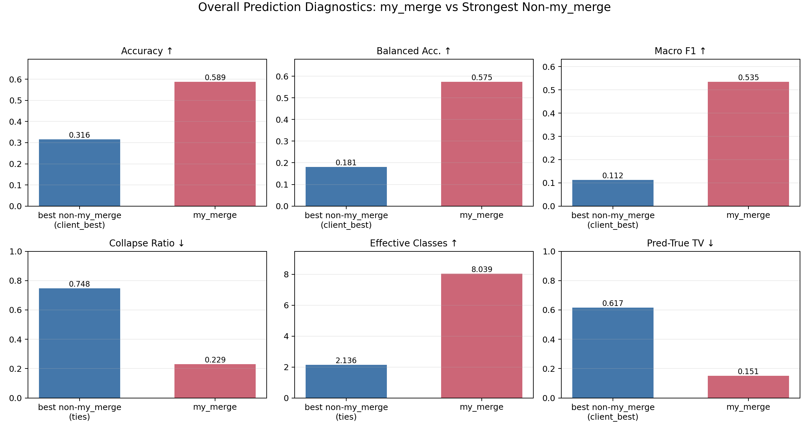
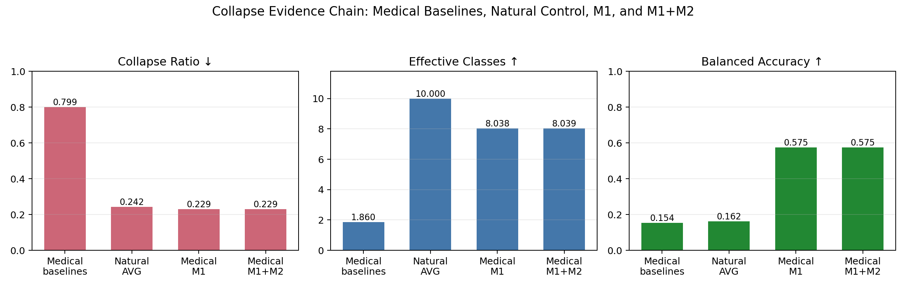

# My Merge 预测坍缩分析实验结果总结

本文件只汇总可用于论文或组会汇报的结果、表格、图和指标解释。实验流程、运行命令和实现细节见其他说明文档。

## 一、核心结论

在 5 个医学图像数据集、4 个 backbone、固定 `clients=3`、`beta=0.01`、`seed=42` 的 20 个 case 上，通用模型融合方法普遍出现预测坍缩：模型大量输出少数类别，导致 accuracy 偶尔被多数类抬高，但 balanced accuracy 和 macro F1 很低。

`my_merge` 的主要结果如下：

| 指标 | my_merge | 最强非 my_merge | 差值 | 结论 |
|---|---:|---:|---:|---|
| Accuracy ↑ | 0.5885 | 0.3156 (`client_best`) | +0.2729 | 总体准确率显著更高 |
| Balanced Accuracy ↑ | 0.5747 | 0.1810 (`client_best`) | +0.3937 | 对长尾类别更稳定 |
| Macro F1 ↑ | 0.5352 | 0.1123 (`client_best`) | +0.4229 | 多类别诊断能力明显更好 |
| Collapse Ratio ↓ | 0.2294 | 0.7477 (`ties`) | -0.5184 | 坍缩显著降低 |
| Effective Classes ↑ | 8.0390 | 2.1360 (`ties`) | +5.9030 | 实际使用类别数大幅增加 |
| Pred-True TV ↓ | 0.1510 | 0.6168 (`client_best`) | -0.4658 | 预测分布更接近真实类别分布 |

总体图：

## 二、坍缩现象链条

这一组分析用于支撑论文里的核心动机：坍缩不是一个普通的 accuracy 波动，而是医学图像模型融合中反复出现的输出分布退化；M1 用类别原型恢复多类诊断输出，M2 加入长尾校准后不破坏这种非坍缩性质。

| 证据 | 数据与方法 | cases | acc | balanced acc | macro F1 | collapse ratio ↓ | effective classes ↑ | pred-true TV ↓ | 结论 |
|---|---|---:|---:|---:|---:|---:|---:|---:|---|
| 医学图像坍缩 | 5 个医学数据集 × 4 backbone，所有通用融合基线，不含 my_merge | 240 | 0.2047 | 0.1535 | 0.0727 | 0.7993 | 1.8600 | 0.7227 | 通用融合平均只使用约 1.86 个有效类别，明显坍缩 |
| 医学 AVG 坍缩 | 同一正式医学设置，仅 AVG | 20 | 0.2304 | 0.1543 | 0.0751 | 0.8028 | 1.7666 | 0.7082 | 最常用权重平均同样坍缩 |
| 自然图像不单类坍缩 | CIFAR-10 partial-label control，类别支持均衡，AVG | 1 | 0.1621 | 0.1621 | 0.1569 | 0.2425 | 10.0000 | - | 融合模型较弱，但仍预测全部 10 类，没有医学式单类坍缩 |
| 加 M1 后医学图像不坍缩 | 正式医学 20 case，M1 only，关闭 M2 | 20 | 0.5884 | 0.5746 | 0.5352 | 0.2294 | 8.0383 | 0.1510 | 类别原型头直接恢复多类别输出 |
| 加 M1+M2 后依旧不坍缩 | 正式医学 20 case，当前 my_merge | 20 | 0.5885 | 0.5747 | 0.5352 | 0.2294 | 8.0390 | 0.1510 | 长尾校准没有重新引入坍缩 |

这张图对应三条要讲清楚的论证：

- 医学图像坍缩：通用融合基线的 `collapse ratio=0.7993`，`effective classes=1.8600`，说明预测集中在极少数类别上。
- 自然图像不坍缩：在 balanced CIFAR-10 partial-label control 中，AVG 的 `collapse ratio=0.2425`，并且 `effective classes=10.0000`。这说明同样的 post-hoc AVG 融合在自然图像控制实验中不会自然退化成医学图像里的单类输出。
- M1/M2 有效：M1 only 已把 `collapse ratio` 从医学基线的 `0.7993` 降到 `0.2294`；加入 M2 后仍保持 `0.2294`，说明 M2 是长尾校准，而不是重新制造多数类坍缩。

相关文件：

- 坍缩证据链 CSV：[my_merge_collapse_story_summary.csv](reports/my_merge_collapse_story_summary.csv)
- M1-only 诊断 CSV：[prediction_diagnostics_m1_only_4models_c3_b001.csv](reports/prediction_diagnostics_m1_only_4models_c3_b001.csv)
- M1-only 按数据集汇总：[prediction_diagnostics_dataset_summary.md](reports/prediction_diagnostics_m1_only_4models_c3_b001/prediction_diagnostics_dataset_summary.md)
- 自然图像对照：[natural_collapse_summary.md](../medmerge_empirical_study/results/experiment9_natural_image_collapse_probe/natural_collapse_summary.md)

## 三、指标说明

| 指标 | 含义 | 方向 | 为什么重要 |
|---|---|---:|---|
| Accuracy | 总体分类正确率 | 越高越好 | 常规主指标，但在医学长尾数据上容易被多数类虚高影响 |
| Balanced Accuracy | 各真实类别召回率的平均值 | 越高越好 | 能反映少数类是否被保留，是证明“非坍缩”的关键指标 |
| Macro F1 | 各类别 F1 的平均值 | 越高越好 | 同时考虑各类别 precision 和 recall，适合多类别诊断 |
| Collapse Ratio | 预测最多类别所占测试样本比例 | 越低越好 | 直接衡量模型是否坍缩到单个或少数类别 |
| Effective Classes | 预测类别分布熵的指数 | 越高越好 | 表示模型实际使用了多少个类别 |
| Pred-True TV | 预测标签分布与真实标签分布的总变差距离 | 越低越好 | 衡量预测分布是否贴近医学数据真实类别比例 |

## 四、总体均值表

20 个 case = 5 个数据集 × 4 个 backbone。`client_mean` 表示客户端平均表现，`client_best` 表示每个 case 中最优客户端表现。

| method | cases | acc | balanced acc | macro F1 | collapse ratio | effective classes | pred-true TV |
|---|---:|---:|---:|---:|---:|---:|---:|
| client_mean | 20 | 0.1804 | 0.1515 | 0.0638 | 0.8207 | 1.7370 | 0.7644 |
| client_best | 20 | 0.3156 | 0.1810 | 0.1123 | 0.7619 | 2.0201 | 0.6168 |
| avg | 20 | 0.2304 | 0.1543 | 0.0751 | 0.8028 | 1.7666 | 0.7082 |
| ties | 20 | 0.2089 | 0.1682 | 0.0858 | 0.7477 | 2.1360 | 0.6907 |
| dare_linear | 20 | 0.2145 | 0.1481 | 0.0745 | 0.7577 | 2.0556 | 0.6849 |
| dare_ties | 20 | 0.1763 | 0.1537 | 0.0689 | 0.7826 | 1.9966 | 0.7367 |
| regmean | 20 | 0.2083 | 0.1625 | 0.0841 | 0.7655 | 2.0285 | 0.7095 |
| fisher | 20 | 0.2585 | 0.1604 | 0.0886 | 0.8228 | 1.9324 | 0.6671 |
| breadcrumbs | 20 | 0.1138 | 0.1181 | 0.0280 | 0.9320 | 1.2901 | 0.8473 |
| model_stock | 20 | 0.2207 | 0.1488 | 0.0711 | 0.8155 | 1.7457 | 0.6970 |
| from | 20 | 0.2494 | 0.1652 | 0.0848 | 0.7705 | 1.8889 | 0.6949 |
| iso_c | 20 | 0.1976 | 0.1648 | 0.0845 | 0.7538 | 2.1161 | 0.7172 |
| free_merge | 20 | 0.2300 | 0.1558 | 0.0762 | 0.8182 | 1.7074 | 0.7158 |
| robustmerge | 20 | 0.1486 | 0.1425 | 0.0502 | 0.8225 | 1.6559 | 0.8035 |
| my_merge | 20 | 0.5885 | 0.5747 | 0.5352 | 0.2294 | 8.0390 | 0.1510 |

## 五、单 case 最优次数

这里统计 20 个 case 上，`my_merge` 是否达到该指标的最优或并列最优。`collapse_ratio` 和 `pred_true_tv` 按越低越好统计，其余指标按越高越好统计。

| 指标 | my_merge 最优/并列最优 | 最强非 my_merge |
|---|---:|---|
| Accuracy | 16/20 | client_best，4/20 |
| Balanced Accuracy | 20/20 | 无 |
| Macro F1 | 20/20 | 无 |
| Collapse Ratio | 20/20 | 无 |
| Pred-True TV | 18/20 | client_best，1/20 |

结论：`my_merge` 不只是提升 accuracy，更稳定地提升了与坍缩相关的分布指标和长尾类别指标。balanced accuracy、macro F1、collapse ratio 三个指标上均为 20/20 最优或并列最优。

## 六、按数据集汇总

| dataset | acc winner | best acc | my_merge acc | my_merge bal. acc | my_merge macro F1 | my_merge collapse | my_merge pred-true TV |
|---|---|---:|---:|---:|---:|---:|---:|
| bloodmnist_224 | my_merge | 0.8190 | 0.8190 | 0.8071 | 0.8022 | 0.1943 | 0.0394 |
| chaoshengmnist_224 | my_merge | 0.4625 | 0.4625 | 0.4536 | 0.4378 | 0.2035 | 0.1575 |
| dermamnist_224 | client_best | 0.6726 | 0.4627 | 0.4492 | 0.2934 | 0.3697 | 0.3309 |
| organcmnist_224 | my_merge | 0.6249 | 0.6249 | 0.6175 | 0.6030 | 0.1772 | 0.1280 |
| organsmnist_224 | my_merge | 0.5734 | 0.5734 | 0.5460 | 0.5397 | 0.2021 | 0.0993 |

按数据集观察：

- `bloodmnist_224`：my_merge 在 accuracy、balanced accuracy、macro F1、collapse ratio、pred-true TV 上均最优，说明该方法能显著缓解血细胞任务中的单类预测坍缩。
- `chaoshengmnist_224`：my_merge 全指标最优，说明原型头对超声类医学图像也有效。
- `dermamnist_224`：accuracy 不如 `client_best`，但 balanced accuracy、macro F1、collapse ratio 仍然最优；这说明部分基线依赖多数类优势获得高 accuracy，而 my_merge 更接近多类别均衡诊断。
- `organcmnist_224` 和 `organsmnist_224`：my_merge 在准确率和分布指标上均明显领先，证明方法不只适用于单一模态。

## 七、图表索引

每个数据集有两类图：

- `prediction_diagnostics.png`：展示 accuracy、balanced accuracy、macro F1、collapse ratio、effective classes、pred-true TV 等指标对比。
- `prediction_distribution.png`：展示不同方法的预测类别分布，用来直观看出是否发生单类坍缩。

| dataset | 指标对比图 | 预测分布图 |
|---|---|---|
| bloodmnist_224 | [metrics](figures/prediction_diagnostics_4models_c3_b001/by_dataset/bloodmnist_224/bloodmnist_224_prediction_diagnostics.png) | [distribution](figures/prediction_diagnostics_4models_c3_b001/by_dataset/bloodmnist_224/bloodmnist_224_prediction_distribution.png) |
| chaoshengmnist_224 | [metrics](figures/prediction_diagnostics_4models_c3_b001/by_dataset/chaoshengmnist_224/chaoshengmnist_224_prediction_diagnostics.png) | [distribution](figures/prediction_diagnostics_4models_c3_b001/by_dataset/chaoshengmnist_224/chaoshengmnist_224_prediction_distribution.png) |
| dermamnist_224 | [metrics](figures/prediction_diagnostics_4models_c3_b001/by_dataset/dermamnist_224/dermamnist_224_prediction_diagnostics.png) | [distribution](figures/prediction_diagnostics_4models_c3_b001/by_dataset/dermamnist_224/dermamnist_224_prediction_distribution.png) |
| organcmnist_224 | [metrics](figures/prediction_diagnostics_4models_c3_b001/by_dataset/organcmnist_224/organcmnist_224_prediction_diagnostics.png) | [distribution](figures/prediction_diagnostics_4models_c3_b001/by_dataset/organcmnist_224/organcmnist_224_prediction_distribution.png) |
| organsmnist_224 | [metrics](figures/prediction_diagnostics_4models_c3_b001/by_dataset/organsmnist_224/organsmnist_224_prediction_diagnostics.png) | [distribution](figures/prediction_diagnostics_4models_c3_b001/by_dataset/organsmnist_224/organsmnist_224_prediction_distribution.png) |

## 八、可用于论文叙述的结果解释

第一，通用模型融合方法在医学图像任务上存在明显预测坍缩。整体来看，`avg`、`ties`、`dare_linear`、`regmean`、`fisher` 等方法的 collapse ratio 大多在 0.75 到 0.82 之间，effective classes 约为 1.7 到 2.1。这说明它们虽然融合了多个客户端模型，但最终预测仍主要集中在极少数类别上。

第二，`my_merge` 显著恢复了多类别诊断能力。它的 collapse ratio 降到 0.2294，effective classes 提升到 8.0390，同时 balanced accuracy 和 macro F1 分别达到 0.5747 和 0.5352。相比最强非 my_merge 方法，macro F1 提升 0.4229，说明提升不是多数类 accuracy 带来的偶然优势。

第三，`dermamnist_224` 是一个有代表性的长尾反例。`client_best` 和 `fisher` 的 accuracy 或 pred-true TV 在该数据集上较高，但它们的 balanced accuracy 和 macro F1 仍远低于 my_merge。这支持 M2 的论文动机：医学数据中类别比例高度不均衡，单纯看 accuracy 可能奖励多数类坍缩，因此需要同时报告 balanced accuracy、macro F1 和 collapse ratio。

第四，自然图像对照用于限制论文结论的边界。CIFAR-10 的 partial-label AVG 融合并不强，但它仍预测所有 10 个类别；医学图像中的问题不是简单的“模型融合都会输出少数类”，而是在医学图像长尾、局部可分、跨客户端类别缺失的共同条件下，通用参数融合更容易退化为诊断类别坍缩。

## 九、原始结果文件

- 全部 clean 明细 CSV：[prediction_diagnostics_all_datasets_clean.csv](reports/prediction_diagnostics_4models_c3_b001/prediction_diagnostics_all_datasets_clean.csv)
- 总体均值 CSV：[prediction_diagnostics_overall_summary_clean.csv](reports/prediction_diagnostics_4models_c3_b001/prediction_diagnostics_overall_summary_clean.csv)
- 按数据集汇总 CSV：[prediction_diagnostics_dataset_summary_clean.csv](reports/prediction_diagnostics_4models_c3_b001/prediction_diagnostics_dataset_summary_clean.csv)
- 单数据集胜出情况 CSV：[prediction_diagnostics_wins_clean.csv](reports/prediction_diagnostics_4models_c3_b001/prediction_diagnostics_wins_clean.csv)
- 坍缩证据链 CSV：[my_merge_collapse_story_summary.csv](reports/my_merge_collapse_story_summary.csv)
- M1-only 明细 CSV：[prediction_diagnostics_m1_only_4models_c3_b001.csv](reports/prediction_diagnostics_m1_only_4models_c3_b001.csv)
