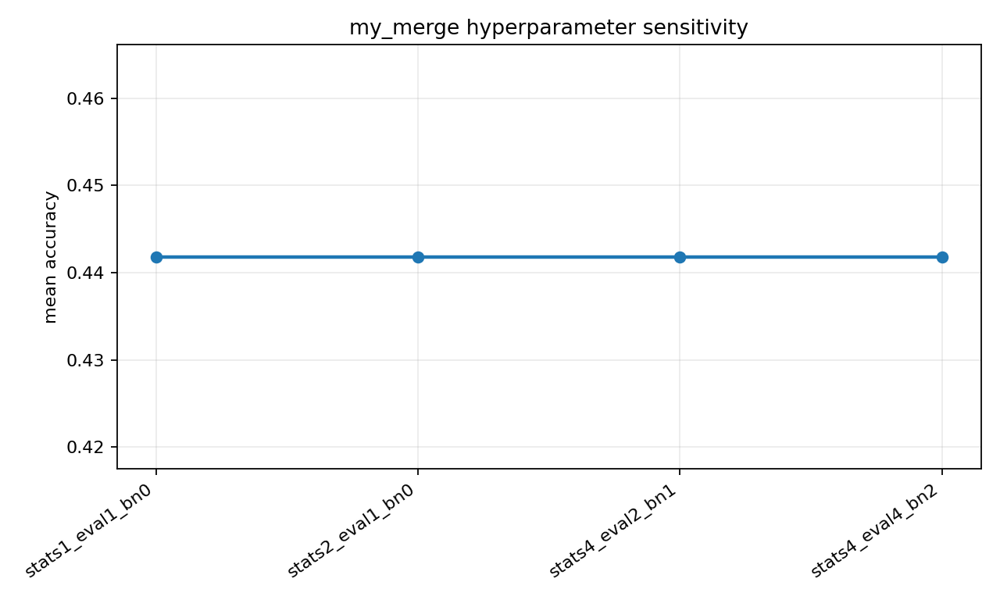
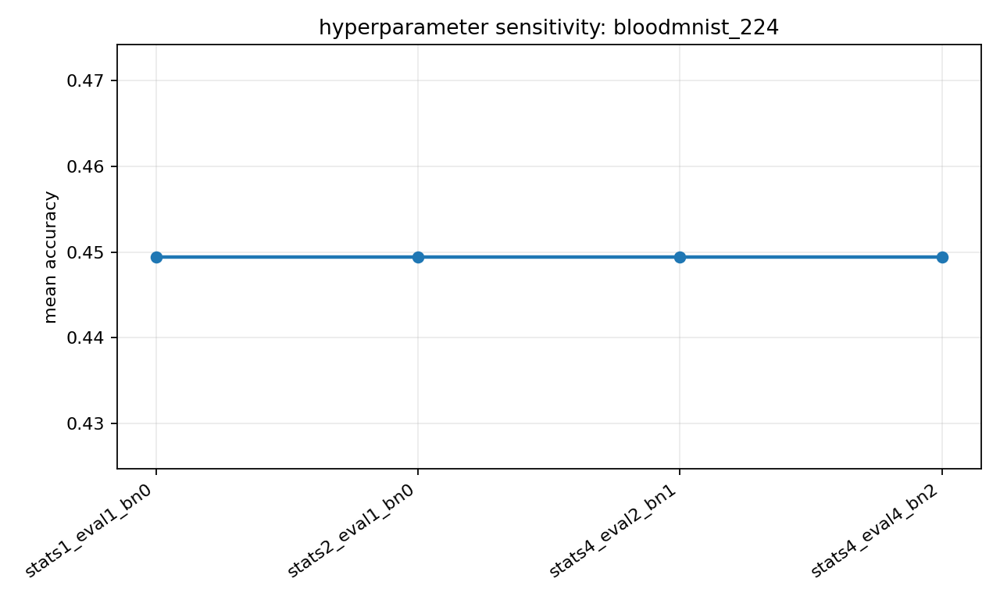
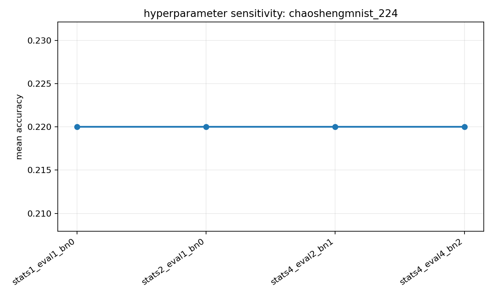
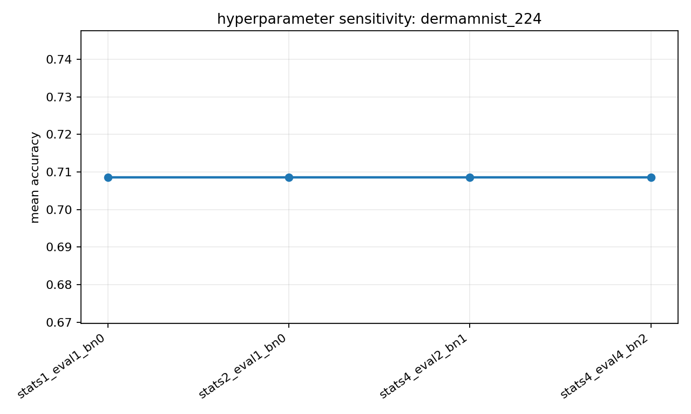
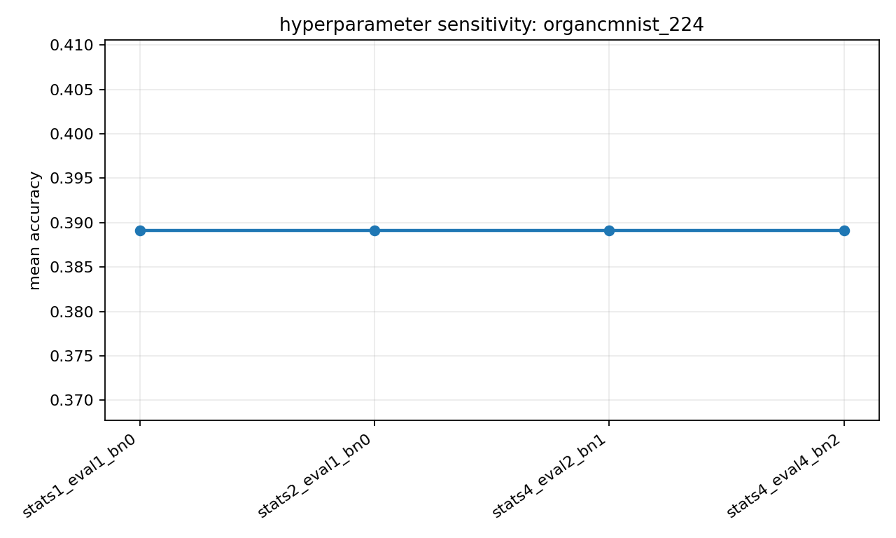

# my_merge Hyperparameter Sensitivity

This report is intentionally separate from the main result table. It is used to inspect whether diagnostic client weights and candidate selection are sensitive to validation batch counts and BN recalibration.

## Overall

| setting | stats | eval | bn | mean_acc | rows |
| --- | --- | --- | --- | --- | --- |
| stats1_eval1_bn0 | 1 | 1 | 0 | 0.4418 | 36 |
| stats2_eval1_bn0 | 2 | 1 | 0 | 0.4418 | 36 |
| stats4_eval2_bn1 | 4 | 2 | 1 | 0.4418 | 36 |
| stats4_eval4_bn2 | 4 | 4 | 2 | 0.4418 | 36 |

## Dataset Plots

- `bloodmnist_224`: 
- `chaoshengmnist_224`: 
- `dermamnist_224`: 
- `organcmnist_224`: 
