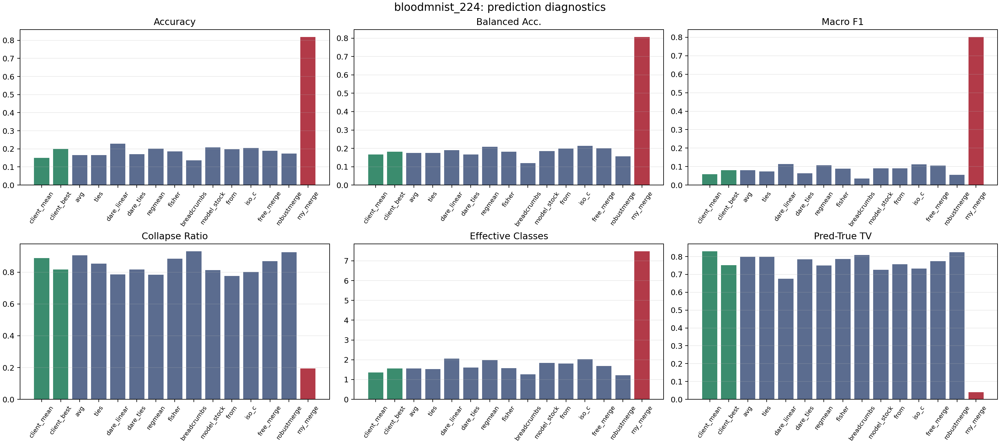
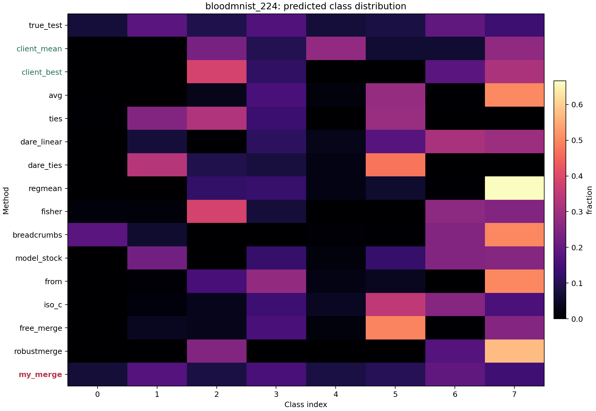
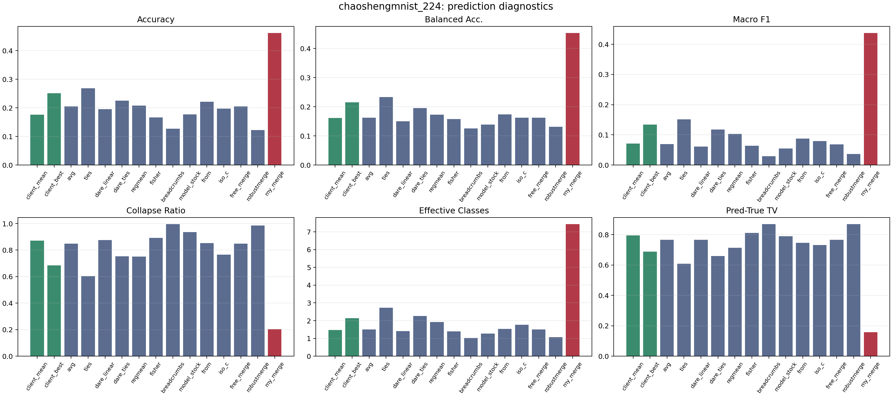
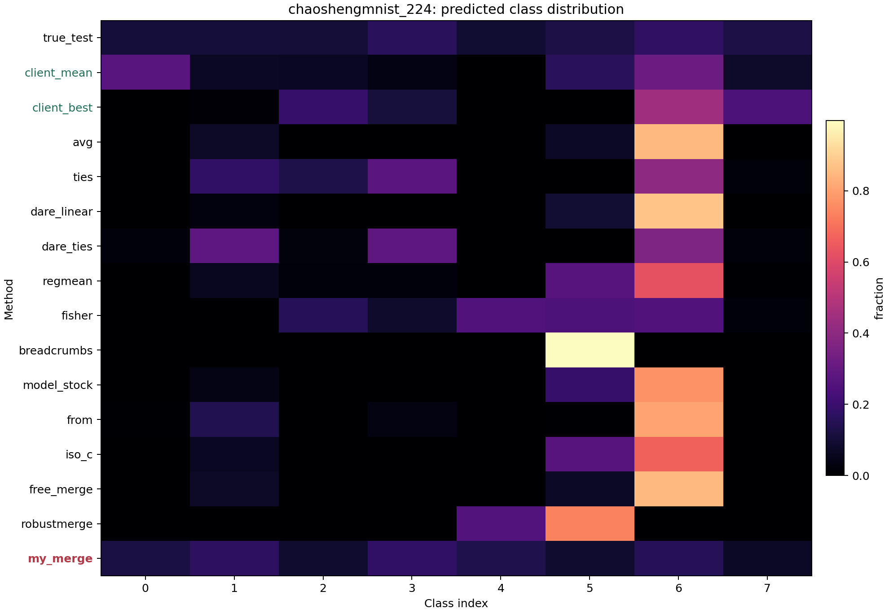
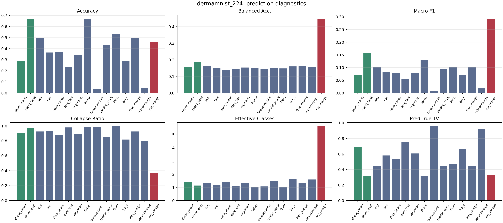
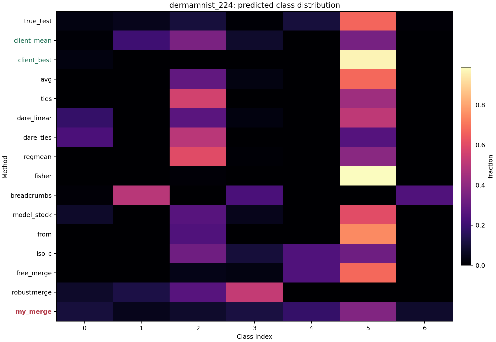
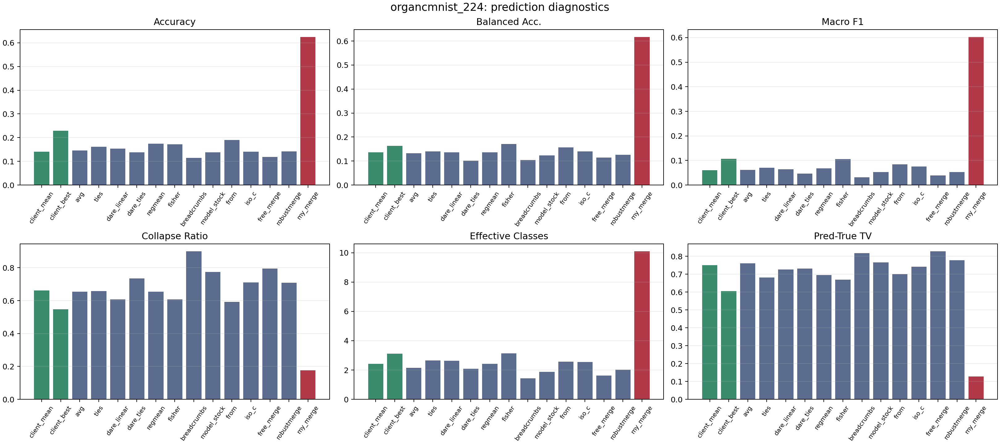
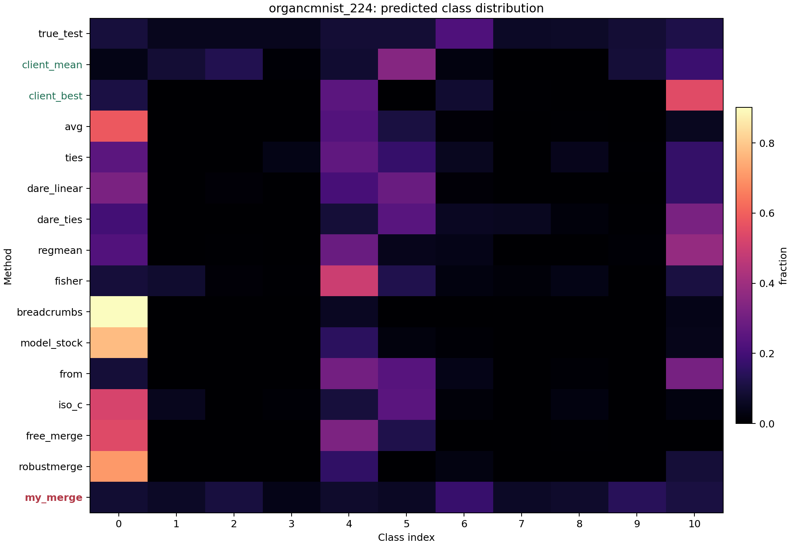
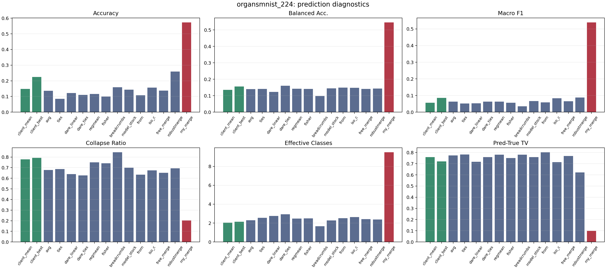
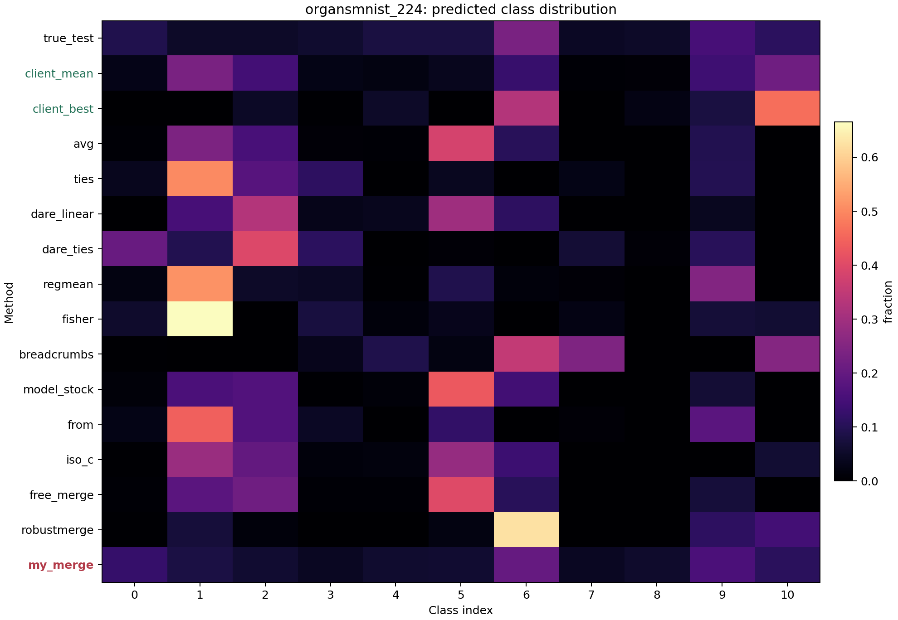

# 全数据集预测坍缩诊断

本报告覆盖 5 个正式医学数据集，每个数据集使用 4 个 backbone（resnet、convnext、vit_t、swin_tiny），固定 `clients=3`、`beta=0.01`、`seed=42`。统计对象包括 individual clients 的聚合行、通用模型融合 baseline，以及 `my_merge`。

原始 OK 评估数为 320；方法级分析表为 300 行，包括 260 个融合方法结果和 40 个 client 聚合结果。补跑前的 10 条 OOM 失败行已单独归档，不参与统计。

## 指标定义

- `collapse_ratio`：测试样本中被预测到最多类别的比例，越高说明越接近单类坍缩。
- `balanced_accuracy`：各真实类别召回率的平均值，用于避免多数类 accuracy 虚高。
- `macro_f1`：各类别 F1 的平均值，衡量多类别诊断是否同时保留。
- `effective_predicted_classes`：预测类别分布熵的指数，表示模型实际使用的类别数。
- `pred_true_tv`：预测标签分布与测试集真实标签分布的总变差距离，越低说明输出分布越接近真实类别比例。

## 总体均值

| method | cases | acc | balanced acc | macro F1 | collapse ratio | effective classes | pred-true TV |
|---|---:|---:|---:|---:|---:|---:|---:|
| client_mean | 20 | 0.1804 | 0.1515 | 0.0638 | 0.8207 | 1.7370 | 0.7644 |
| client_best | 20 | 0.3156 | 0.1810 | 0.1123 | 0.7619 | 2.0201 | 0.6168 |
| avg | 20 | 0.2304 | 0.1543 | 0.0751 | 0.8028 | 1.7666 | 0.7082 |
| ties | 20 | 0.2089 | 0.1682 | 0.0858 | 0.7477 | 2.1360 | 0.6907 |
| dare_linear | 20 | 0.2145 | 0.1481 | 0.0745 | 0.7577 | 2.0556 | 0.6849 |
| dare_ties | 20 | 0.1763 | 0.1537 | 0.0689 | 0.7826 | 1.9966 | 0.7367 |
| regmean | 20 | 0.2083 | 0.1625 | 0.0841 | 0.7655 | 2.0285 | 0.7095 |
| fisher | 20 | 0.2585 | 0.1604 | 0.0886 | 0.8228 | 1.9324 | 0.6671 |
| breadcrumbs | 20 | 0.1138 | 0.1181 | 0.0280 | 0.9320 | 1.2901 | 0.8473 |
| model_stock | 20 | 0.2207 | 0.1488 | 0.0711 | 0.8155 | 1.7457 | 0.6970 |
| from | 20 | 0.2494 | 0.1652 | 0.0848 | 0.7705 | 1.8889 | 0.6949 |
| iso_c | 20 | 0.1976 | 0.1648 | 0.0845 | 0.7538 | 2.1161 | 0.7172 |
| free_merge | 20 | 0.2300 | 0.1558 | 0.0762 | 0.8182 | 1.7074 | 0.7158 |
| robustmerge | 20 | 0.1486 | 0.1425 | 0.0502 | 0.8225 | 1.6559 | 0.8035 |
| my_merge | 20 | 0.5885 | 0.5747 | 0.5352 | 0.2294 | 8.0390 | 0.1510 |

## 单 case 最优次数

20 个 case = 5 个数据集 × 4 个 backbone。`collapse_ratio` 和 `pred_true_tv` 按越低越好统计，其余指标按越高越好统计。

| metric | my_merge best/tied cases | strongest non-my_merge |
|---|---:|---|
| accuracy | 16/20 | client_best (4/20) |
| balanced_accuracy | 20/20 | - |
| macro_f1 | 20/20 | - |
| collapse_ratio | 20/20 | - |
| pred_true_tv | 18/20 | client_best (1/20) |

## 按数据集汇总

### bloodmnist_224

| method | cases | acc | balanced acc | macro F1 | collapse ratio | effective classes | pred-true TV |
|---|---:|---:|---:|---:|---:|---:|---:|
| client_mean | 4 | 0.1508 | 0.1668 | 0.0594 | 0.8887 | 1.3608 | 0.8303 |
| client_best | 4 | 0.1997 | 0.1820 | 0.0796 | 0.8164 | 1.5669 | 0.7518 |
| avg | 4 | 0.1663 | 0.1746 | 0.0797 | 0.9072 | 1.5593 | 0.7988 |
| ties | 4 | 0.1659 | 0.1748 | 0.0738 | 0.8532 | 1.5218 | 0.7990 |
| dare_linear | 4 | 0.2286 | 0.1908 | 0.1133 | 0.7851 | 2.0533 | 0.6759 |
| dare_ties | 4 | 0.1700 | 0.1667 | 0.0633 | 0.8162 | 1.5993 | 0.7843 |
| regmean | 4 | 0.2014 | 0.2082 | 0.1069 | 0.7846 | 1.9760 | 0.7507 |
| fisher | 4 | 0.1866 | 0.1822 | 0.0892 | 0.8845 | 1.5790 | 0.7865 |
| breadcrumbs | 4 | 0.1366 | 0.1201 | 0.0353 | 0.9324 | 1.2647 | 0.8094 |
| model_stock | 4 | 0.2081 | 0.1843 | 0.0897 | 0.8123 | 1.8387 | 0.7265 |
| from | 4 | 0.1978 | 0.1985 | 0.0911 | 0.7768 | 1.8028 | 0.7570 |
| iso_c | 4 | 0.2051 | 0.2129 | 0.1115 | 0.8009 | 2.0307 | 0.7329 |
| free_merge | 4 | 0.1900 | 0.2001 | 0.1055 | 0.8691 | 1.6915 | 0.7743 |
| robustmerge | 4 | 0.1733 | 0.1557 | 0.0552 | 0.9263 | 1.2224 | 0.8241 |
| my_merge | 4 | 0.8190 | 0.8071 | 0.8022 | 0.1943 | 7.4876 | 0.0394 |

### chaoshengmnist_224

| method | cases | acc | balanced acc | macro F1 | collapse ratio | effective classes | pred-true TV |
|---|---:|---:|---:|---:|---:|---:|---:|
| client_mean | 4 | 0.1761 | 0.1614 | 0.0710 | 0.8707 | 1.4686 | 0.7959 |
| client_best | 4 | 0.2511 | 0.2153 | 0.1339 | 0.6858 | 2.1465 | 0.6876 |
| avg | 4 | 0.2055 | 0.1624 | 0.0691 | 0.8491 | 1.5095 | 0.7666 |
| ties | 4 | 0.2682 | 0.2335 | 0.1514 | 0.6047 | 2.7298 | 0.6094 |
| dare_linear | 4 | 0.1959 | 0.1503 | 0.0613 | 0.8756 | 1.4115 | 0.7666 |
| dare_ties | 4 | 0.2253 | 0.1952 | 0.1176 | 0.7538 | 2.2628 | 0.6595 |
| regmean | 4 | 0.2075 | 0.1731 | 0.1031 | 0.7513 | 1.9191 | 0.7145 |
| fisher | 4 | 0.1664 | 0.1577 | 0.0637 | 0.8924 | 1.3952 | 0.8109 |
| breadcrumbs | 4 | 0.1271 | 0.1255 | 0.0291 | 0.9969 | 1.0175 | 0.8702 |
| model_stock | 4 | 0.1774 | 0.1389 | 0.0547 | 0.9364 | 1.2700 | 0.7895 |
| from | 4 | 0.2219 | 0.1740 | 0.0875 | 0.8535 | 1.5321 | 0.7469 |
| iso_c | 4 | 0.1972 | 0.1626 | 0.0790 | 0.7653 | 1.7663 | 0.7318 |
| free_merge | 4 | 0.2053 | 0.1622 | 0.0688 | 0.8493 | 1.5077 | 0.7668 |
| robustmerge | 4 | 0.1224 | 0.1316 | 0.0364 | 0.9863 | 1.0681 | 0.8688 |
| my_merge | 4 | 0.4625 | 0.4536 | 0.4378 | 0.2035 | 7.4446 | 0.1575 |

### dermamnist_224

| method | cases | acc | balanced acc | macro F1 | collapse ratio | effective classes | pred-true TV |
|---|---:|---:|---:|---:|---:|---:|---:|
| client_mean | 4 | 0.2853 | 0.1584 | 0.0714 | 0.9045 | 1.3942 | 0.6875 |
| client_best | 4 | 0.6726 | 0.1890 | 0.1562 | 0.9670 | 1.1366 | 0.3193 |
| avg | 4 | 0.4984 | 0.1614 | 0.1015 | 0.9259 | 1.3118 | 0.4406 |
| ties | 4 | 0.3648 | 0.1506 | 0.0819 | 0.9360 | 1.2061 | 0.5818 |
| dare_linear | 4 | 0.3717 | 0.1395 | 0.0800 | 0.8818 | 1.4224 | 0.5395 |
| dare_ties | 4 | 0.2374 | 0.1451 | 0.0543 | 0.9802 | 1.0942 | 0.7499 |
| regmean | 4 | 0.3414 | 0.1533 | 0.0798 | 0.8884 | 1.3371 | 0.6072 |
| fisher | 4 | 0.6683 | 0.1507 | 0.1286 | 0.9873 | 1.0598 | 0.3185 |
| breadcrumbs | 4 | 0.0322 | 0.1429 | 0.0089 | 0.9840 | 1.0715 | 0.9589 |
| model_stock | 4 | 0.4360 | 0.1520 | 0.0927 | 0.8549 | 1.4847 | 0.4444 |
| from | 4 | 0.5299 | 0.1478 | 0.1019 | 0.9970 | 1.0191 | 0.4680 |
| iso_c | 4 | 0.2885 | 0.1604 | 0.0723 | 0.8178 | 1.6154 | 0.6665 |
| free_merge | 4 | 0.4988 | 0.1614 | 0.1016 | 0.9259 | 1.3118 | 0.4403 |
| robustmerge | 4 | 0.0461 | 0.1555 | 0.0178 | 0.7978 | 1.5972 | 0.9247 |
| my_merge | 4 | 0.4627 | 0.4492 | 0.2934 | 0.3697 | 5.6501 | 0.3309 |

### organcmnist_224

| method | cases | acc | balanced acc | macro F1 | collapse ratio | effective classes | pred-true TV |
|---|---:|---:|---:|---:|---:|---:|---:|
| client_mean | 4 | 0.1412 | 0.1359 | 0.0610 | 0.6614 | 2.4316 | 0.7497 |
| client_best | 4 | 0.2297 | 0.1632 | 0.1067 | 0.5474 | 3.1079 | 0.6055 |
| avg | 4 | 0.1462 | 0.1329 | 0.0618 | 0.6549 | 2.1461 | 0.7609 |
| ties | 4 | 0.1609 | 0.1408 | 0.0701 | 0.6589 | 2.6615 | 0.6811 |
| dare_linear | 4 | 0.1538 | 0.1367 | 0.0642 | 0.6070 | 2.6419 | 0.7253 |
| dare_ties | 4 | 0.1386 | 0.1012 | 0.0464 | 0.7355 | 2.0930 | 0.7310 |
| regmean | 4 | 0.1745 | 0.1365 | 0.0678 | 0.6538 | 2.4287 | 0.6953 |
| fisher | 4 | 0.1717 | 0.1708 | 0.1054 | 0.6081 | 3.1308 | 0.6693 |
| breadcrumbs | 4 | 0.1142 | 0.1036 | 0.0311 | 0.9009 | 1.4261 | 0.8171 |
| model_stock | 4 | 0.1380 | 0.1237 | 0.0526 | 0.7743 | 1.8678 | 0.7656 |
| from | 4 | 0.1904 | 0.1570 | 0.0845 | 0.5921 | 2.5737 | 0.6998 |
| iso_c | 4 | 0.1403 | 0.1398 | 0.0757 | 0.7107 | 2.5383 | 0.7409 |
| free_merge | 4 | 0.1186 | 0.1142 | 0.0396 | 0.7945 | 1.6177 | 0.8286 |
| robustmerge | 4 | 0.1425 | 0.1258 | 0.0534 | 0.7085 | 2.0226 | 0.7771 |
| my_merge | 4 | 0.6249 | 0.6175 | 0.6030 | 0.1772 | 10.1092 | 0.1280 |

### organsmnist_224

| method | cases | acc | balanced acc | macro F1 | collapse ratio | effective classes | pred-true TV |
|---|---:|---:|---:|---:|---:|---:|---:|
| client_mean | 4 | 0.1486 | 0.1349 | 0.0563 | 0.7784 | 2.0299 | 0.7586 |
| client_best | 4 | 0.2249 | 0.1553 | 0.0852 | 0.7929 | 2.1428 | 0.7199 |
| avg | 4 | 0.1358 | 0.1402 | 0.0635 | 0.6770 | 2.3065 | 0.7739 |
| ties | 4 | 0.0849 | 0.1415 | 0.0520 | 0.6860 | 2.5606 | 0.7823 |
| dare_linear | 4 | 0.1224 | 0.1232 | 0.0535 | 0.6392 | 2.7491 | 0.7173 |
| dare_ties | 4 | 0.1101 | 0.1603 | 0.0631 | 0.6274 | 2.9335 | 0.7590 |
| regmean | 4 | 0.1165 | 0.1416 | 0.0630 | 0.7495 | 2.4814 | 0.7798 |
| fisher | 4 | 0.0993 | 0.1409 | 0.0563 | 0.7415 | 2.4974 | 0.7503 |
| breadcrumbs | 4 | 0.1589 | 0.0982 | 0.0355 | 0.8458 | 1.6706 | 0.7810 |
| model_stock | 4 | 0.1438 | 0.1449 | 0.0659 | 0.6996 | 2.2675 | 0.7588 |
| from | 4 | 0.1070 | 0.1489 | 0.0589 | 0.6332 | 2.5170 | 0.8031 |
| iso_c | 4 | 0.1568 | 0.1482 | 0.0836 | 0.6742 | 2.6297 | 0.7139 |
| free_merge | 4 | 0.1372 | 0.1410 | 0.0656 | 0.6519 | 2.4085 | 0.7691 |
| robustmerge | 4 | 0.2586 | 0.1438 | 0.0881 | 0.6939 | 2.3693 | 0.6226 |
| my_merge | 4 | 0.5734 | 0.5460 | 0.5397 | 0.2021 | 9.5033 | 0.0993 |

## 文件索引

- Clean raw CSV: `My_merge_ret/reports/prediction_diagnostics_4models_c3_b001/prediction_diagnostics_all_datasets_clean.csv`
- Client aggregate CSV: `My_merge_ret/reports/prediction_diagnostics_4models_c3_b001/prediction_diagnostics_with_client_aggregates_clean.csv`
- Dataset summary CSV: `My_merge_ret/reports/prediction_diagnostics_4models_c3_b001/prediction_diagnostics_dataset_summary_clean.csv`
- Overall summary CSV: `My_merge_ret/reports/prediction_diagnostics_4models_c3_b001/prediction_diagnostics_overall_summary_clean.csv`
- Archived failed rows: `My_merge_ret/reports/prediction_diagnostics_4models_c3_b001/prediction_diagnostics_failures_archived.csv`
