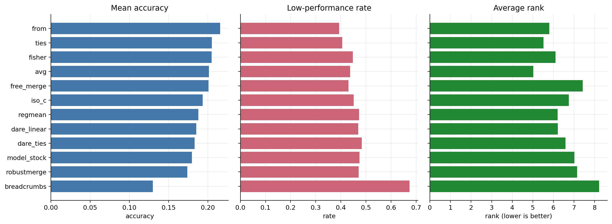
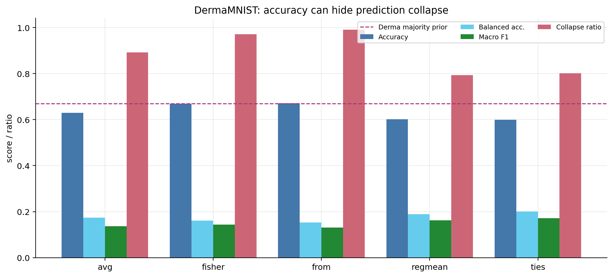
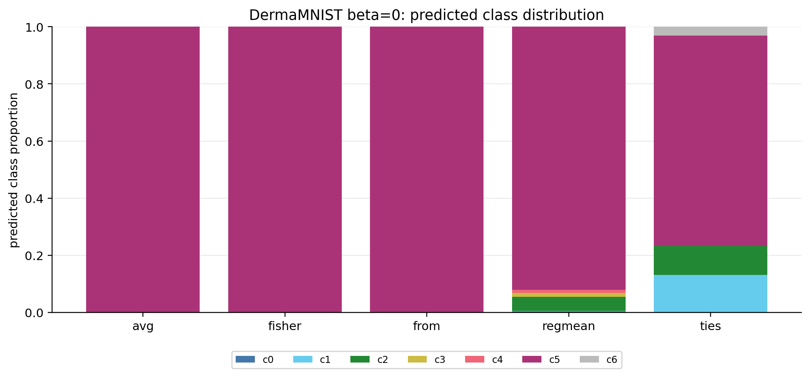
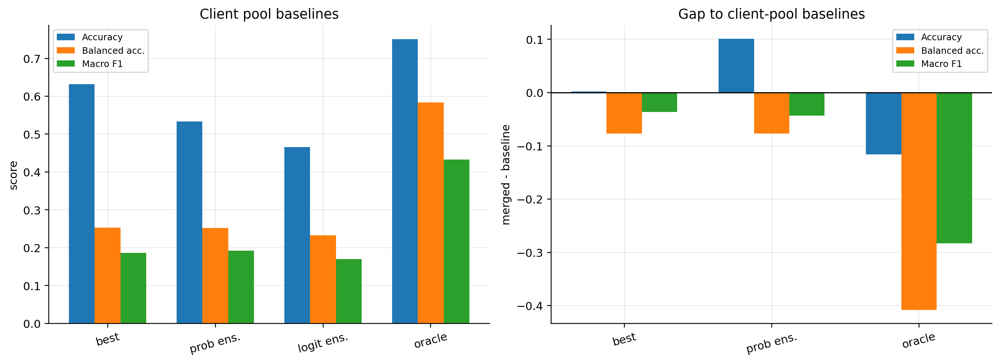
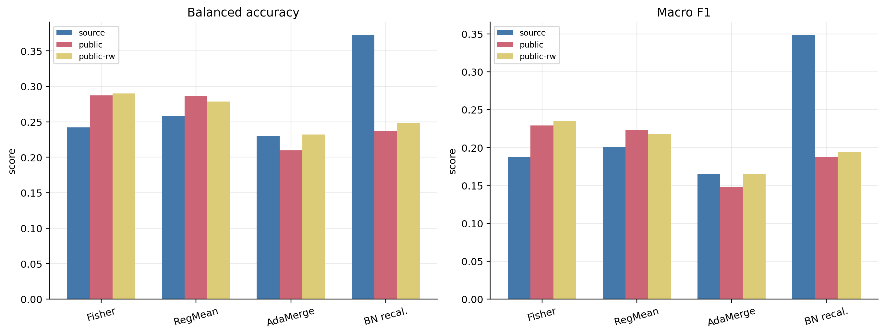
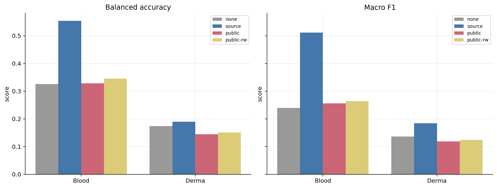

# 医学异质客户端模型融合是否需要源域图像统计？一项经验研究

## 摘要

本文整理了一组围绕医学客户端模型融合的经验实验。研究目标不是提出新的融合算法，也不使用 MyMerge 作为论文主线，而是检验一个更基础的问题：在医学异质客户端场景下，仅依赖 checkpoint 权重或同类型公开医学数据，是否足以得到可靠的模型融合结果？

实验结论可以概括为三点。第一，已有后训练融合方法在医学任务上不稳定，accuracy 容易被多数类预测和类别塌缩误导。第二，客户端池本身并非完全无效，prediction ensemble 和 oracle client 说明客户端之间存在可利用互补信息，但权重空间融合没有稳定恢复这些信息。第三，同类型公开医学数据不是无用数据；它有时能提供有益统计，但不能作为稳定、可预期的源域验证图像替代，尤其在 BN recalibration 这类模型状态统计恢复中，源域验证图像优势非常明显。

## 1. 研究问题

医学模型融合常被当成 checkpoint-level 或 weight-space 问题：给定多个本地训练后的客户端模型，直接对权重、task vector 或几何结构做融合，然后在测试集上评估。但医学客户端的异质性通常不只是类别比例不同，还可能来自设备、采集协议、染色方式、病人群体和组织区域差异。

因此本文关注的问题是：

> 可靠的医学客户端模型融合，是否需要与源域分布匹配的图像统计？

这里的“源域图像统计”不一定要求原始训练集全量可见；更准确地说，是需要能代表客户端源域分布的验证图像或等价统计。为了避免 trivial negative control，本文没有使用错误医学数据集作为主证据，而是使用已经清洗、映射、去重的同类型公开医学数据，检验它是否能替代源域验证图像。

## 2. 实验资产与方法

所有实验都使用已有训练好客户端和已有融合基线，不重新训练客户端。实验代码和结果均放在 `medmerge_empirical_study/` 目录下。

实验一的大规模 accuracy 诊断覆盖 7 个数据集、12 个融合方法、567 个 setting，共 6804 条 accuracy 记录。逐样本诊断选取 DermaMNIST / ResNet / 3 clients / beta = 0, 0.01, 0.1 作为代表性子集，补充 balanced accuracy、macro F1 和预测塌缩指标。

实验二在同一 DermaMNIST / ResNet / 3 clients / 三个 beta 子集上评估 single client、best single client、prediction ensemble 和 oracle client，用来判断客户端池中是否存在可利用信息。

实验三覆盖 BloodMNIST 与 DermaMNIST，使用 ResNet / 3 clients / beta = 0, 0.01, 0.1。参与方法包括 Fisher、RegMean、AdaMerging 和 BN recalibration。固定 checkpoint、测试集和超参数，只替换统计或校准图像来源：

- `source_val_512`：从原始源域验证集抽取 512 张图像。
- `public_labeled_val_512`：同类型公开医学数据 512 张。
- `public_labeled_reweighted_512`：公开医学数据按源域验证集类别比例重采样。
- `no_image_stats` / `no_recalibration`：不使用图像统计或不做 BN 校准。

公开数据使用仓库中已有的高质量同类型数据：BloodMNIST 对应 `Falah/Blood_8_classes_Dataset`，8 类一一映射；DermaMNIST 对应 `flwrlabs/fed-isic2019`，映射到 DermaMNIST 7 类，丢弃不能映射的 squamous cell carcinoma。测试集始终是原始 `Med_data` 的 test split。

## 3. 指标定义

**Accuracy** 是总体正确率：

```text
accuracy = 正确预测样本数 / 总样本数
```

它直观但在类别不均衡医学数据上风险很大。如果多数类占比很高，模型只预测多数类也可能得到不低 accuracy。

**Per-class recall** 衡量每一类被正确识别的比例：

```text
recall_k = TP_k / (TP_k + FN_k)
```

它回答的问题是：真实属于第 k 类的样本中，有多少被模型识别出来。

**Balanced accuracy** 是各类别 recall 的平均值：

```text
balanced_accuracy = mean_k recall_k
```

它降低了类别不均衡带来的误导。如果 7 类任务中模型只预测一个类别，那么 balanced accuracy 往往接近 1/7。

**Precision** 衡量预测为某类的样本中有多少是真的：

```text
precision_k = TP_k / (TP_k + FP_k)
```

**F1** 是 precision 和 recall 的调和平均：

```text
F1_k = 2 * precision_k * recall_k / (precision_k + recall_k)
```

**Macro F1** 是各类别 F1 的平均值。它与 balanced accuracy 一样，对类别不均衡更敏感。

**Test loss / NLL** 是交叉熵损失。它不仅看预测是否正确，还看模型对预测类别的置信度。

**majority_prediction_ratio** 是预测类别分布中最大类别的比例：

```text
majority_prediction_ratio = max_k count(pred = k) / N
```

如果这个值接近 1，说明模型几乎只预测一个类别，发生了预测塌缩。

**effective_predicted_classes** 是预测类别分布熵的指数：

```text
effective_predicted_classes = exp(H(predicted_class_distribution))
```

如果该值接近 1，说明模型有效使用的预测类别数只有 1 个；如果接近真实类别数，说明预测分布更分散。

**表格列名与缩写说明** 如下。这里的一个 `case` 指一个固定实验设置，例如 dataset、backbone、client 数量、beta 和 seed 的组合；如果表格还区分校准来源，则同一设置下不同 calibration source 会分别计为不同记录。

| 列名 | 含义 |
|---|---|
| `Cases` | 参与该行统计的记录数。 |
| `Mean Acc` | 该方法在所有对应 cases 上的 accuracy 平均值。 |
| `Median Acc` | 该方法在所有对应 cases 上的 accuracy 中位数；它比均值更不容易被少数极端 setting 拉动。 |
| `Mean BAcc` | balanced accuracy 的平均值，即各 case 的 balanced accuracy 再取平均。 |
| `Mean Macro F1` | macro F1 的平均值，即各 case 的 macro F1 再取平均。 |
| `Mean Collapse` | `majority_prediction_ratio` 的平均值；越接近 1，说明越容易预测到单一类别。 |
| `Median Eff. Classes` | `effective_predicted_classes` 的中位数；越接近 1，说明有效使用的预测类别越少。 |
| `Wins` | 在同一个实验 setting 内，该方法 accuracy 排名第一的次数；并列第一按并列 win 计入。 |
| `Avg Rank` | 在每个 setting 内按 accuracy 对所有方法排序后，该方法排名的平均值；数值越小表示整体排名越靠前。 |
| `Low Perf.` | 低效 setting 比例。本文定义为 `accuracy <= random_prior + 0.02`，其中 `random_prior = 1 / 类别数`。例如 8 类任务中随机先验约为 0.125，accuracy 不超过 0.145 会被计为 low-performance。 |
| `Delta vs Avg` | 相对普通权重平均 `Avg` 的 accuracy 差值，计算为 `method_accuracy - avg_accuracy`，再对所有 cases 取平均。正值表示平均上优于 Avg，负值表示平均上低于 Avg。 |
| `Acc Gap` / `BAcc Gap` / `Macro F1 Gap` | 实验二中融合模型相对某个客户端池 baseline 的差值，计算为 `merged_model - baseline`。负值表示融合模型低于该 baseline。 |

## 4. 实验一：已有融合方法的稳定性与类别塌缩

### 4.1 大规模 accuracy 结果

表 1 汇总了正式 accuracy 大表。它说明没有单一方法稳定统治所有 setting。FROM 的 mean accuracy 最高，但 low-performance rate 仍接近 39%；TIES、Fisher、Avg 等方法也有大量低效 setting。

**表 1：已有融合方法的大规模 accuracy 诊断**

| 方法 | Mean Acc | Median Acc | Wins | Avg Rank | Low Perf. | Delta vs Avg |
|---|---|---|---|---|---|---|
| from | 0.2154 | 0.1547 | 111 | 5.80 | 39.3% | +0.0143 |
| ties | 0.2050 | 0.1528 | 115 | 5.52 | 40.6% | +0.0038 |
| fisher | 0.2048 | 0.1374 | 111 | 6.10 | 44.8% | +0.0037 |
| avg | 0.2011 | 0.1392 | 63 | 5.02 | 43.7% | +0.0000 |
| free_merge | 0.2007 | 0.1391 | 74 | 7.43 | 43.0% | -0.0005 |
| iso_c | 0.1933 | 0.1394 | 79 | 6.75 | 45.1% | -0.0078 |
| regmean | 0.1878 | 0.1374 | 78 | 6.20 | 47.3% | -0.0134 |
| dare_linear | 0.1852 | 0.1352 | 54 | 6.21 | 46.9% | -0.0160 |
| dare_ties | 0.1829 | 0.1284 | 71 | 6.59 | 48.3% | -0.0182 |
| model_stock | 0.1794 | 0.1366 | 69 | 7.02 | 47.4% | -0.0217 |
| robustmerge | 0.1738 | 0.1374 | 79 | 7.15 | 47.1% | -0.0273 |
| breadcrumbs | 0.1299 | 0.1087 | 50 | 8.22 | 67.4% | -0.0713 |



**图 1** 展示各方法 mean accuracy、low-performance rate 和 average rank。可以看到，mean accuracy 的局部领先并不等于稳定可靠；多个方法低效比例较高，且 average rank 没有形成压倒性优势。

### 4.2 逐样本诊断：accuracy 掩盖多数类塌缩

DermaMNIST test set 的多数类先验为 0.6688。逐样本诊断表明，多个方法 accuracy 接近 0.67，但 balanced accuracy 和 macro F1 很低，说明模型并没有真正解决多类别识别，而是在不同程度上预测多数类。

**表 2：DermaMNIST / ResNet / c3 的逐样本预测级诊断**

| 方法 | Cases | Mean Acc | Mean BAcc | Mean Macro F1 | Mean Collapse | Median Eff. Classes |
|---|---|---|---|---|---|---|
| avg | 3 | 0.6291 | 0.1737 | 0.1363 | 0.8926 | 1.14 |
| fisher | 3 | 0.6687 | 0.1613 | 0.1441 | 0.9716 | 1.17 |
| from | 3 | 0.6713 | 0.1526 | 0.1311 | 0.9909 | 1.03 |
| regmean | 3 | 0.6018 | 0.1891 | 0.1628 | 0.7930 | 1.43 |
| ties | 3 | 0.5995 | 0.2009 | 0.1719 | 0.8015 | 1.82 |



**图 2** 显示，Avg、Fisher、FROM 的 accuracy 很高，但 collapse ratio 也很高，balanced accuracy 和 macro F1 远低于 accuracy。这个现象说明医学模型融合不能只报告 accuracy。



**图 3** 展示 beta=0 时各方法预测类别分布。Avg、Fisher、FROM 基本退化为单类预测；TIES 和 RegMean 虽然仍不理想，但预测类别分布略更分散。

实验一支持的结论是：

> 现有后训练融合方法直接用于医学异质客户端时并不稳定；单看 accuracy 会掩盖类别塌缩，必须同时报告 balanced accuracy、macro F1、per-class recall 和预测分布。

## 5. 实验二：客户端池是否有可用知识

实验二的目的不是证明某个融合方法更好，而是判断融合失败是否只是因为客户端都很弱。为此，我们评估了 single client、best single client、prediction ensemble 和 oracle client。

**表 3：客户端池 baseline**

| Baseline | Cases | Mean Acc | Mean BAcc | Mean Macro F1 | Mean Collapse |
|---|---|---|---|---|---|
| best_single_client | 3 | 0.6323 | 0.2525 | 0.1859 | 0.8160 |
| prob_ensemble | 3 | 0.5328 | 0.2524 | 0.1923 | 0.6195 |
| logit_ensemble | 3 | 0.4658 | 0.2328 | 0.1698 | 0.6444 |
| oracle_any_correct | 3 | 0.7505 | 0.5834 | 0.4325 | 0.6258 |
| oracle_min_loss | 3 | 0.7498 | 0.5792 | 0.4316 | 0.6256 |

**表 4：融合模型相对客户端池 baseline 的 gap**

| 比较 | Acc Gap | BAcc Gap | Macro F1 Gap |
|---|---|---|---|
| merged - best_single_client | +0.0018 | -0.0770 | -0.0367 |
| merged - prob_ensemble | +0.1012 | -0.0769 | -0.0430 |
| merged - logit_ensemble | +0.1682 | -0.0573 | -0.0206 |
| merged - oracle_any_correct | -0.1164 | -0.4079 | -0.2833 |
| merged - oracle_min_loss | -0.1157 | -0.4037 | -0.2823 |



**图 4** 左侧显示客户端池 baseline 的性能，右侧显示融合模型相对这些 baseline 的 gap。oracle_any_correct 的 mean balanced accuracy 达到 0.5834，而融合模型相对 oracle 的 balanced accuracy 平均 gap 为 -0.4079。

这个结果说明客户端池中存在可用信息。即使单个客户端不一定强，多个客户端在样本层面具有互补性。融合失败更准确的解释不是“客户端都弱”，而是：

> 权重空间融合没有稳定恢复客户端池中的互补知识。

## 6. 实验三：同类型公开数据能否替代源域验证图像

实验三固定 client checkpoint、merge 方法、测试集和超参数，只替换 Fisher、RegMean、AdaMerging 和 BN recalibration 所使用的统计或校准数据来源。所有结果 84 / 84 条成功。

**表 5：源域验证集与同类型公开数据替代实验**

| 方法 | 统计/校准来源 | Cases | Mean Acc | Mean BAcc | Mean Macro F1 | Mean Collapse |
|---|---|---|---|---|---|---|
| avg | no_image_stats | 6 | 0.4818 | 0.2496 | 0.1878 | 0.7339 |
| fisher | source_val_512 | 6 | 0.5015 | 0.2421 | 0.1878 | 0.7713 |
| fisher | public_labeled_val_512 | 6 | 0.4944 | 0.2871 | 0.2290 | 0.6681 |
| fisher | public_labeled_reweighted_512 | 6 | 0.4945 | 0.2897 | 0.2353 | 0.6452 |
| regmean | source_val_512 | 6 | 0.4518 | 0.2586 | 0.2008 | 0.6712 |
| regmean | public_labeled_val_512 | 6 | 0.4468 | 0.2861 | 0.2234 | 0.5887 |
| regmean | public_labeled_reweighted_512 | 6 | 0.4496 | 0.2784 | 0.2178 | 0.5970 |
| adamerging | source_val_512 | 6 | 0.4869 | 0.2299 | 0.1653 | 0.8455 |
| adamerging | public_labeled_val_512 | 6 | 0.4650 | 0.2097 | 0.1481 | 0.8076 |
| adamerging | public_labeled_reweighted_512 | 6 | 0.4899 | 0.2322 | 0.1650 | 0.8411 |
| bn_recalibration | no_recalibration | 6 | 0.4818 | 0.2496 | 0.1878 | 0.7339 |
| bn_recalibration | source_val_512 | 6 | 0.6330 | 0.3719 | 0.3481 | 0.7141 |
| bn_recalibration | public_labeled_val_512 | 6 | 0.5061 | 0.2366 | 0.1872 | 0.8621 |
| bn_recalibration | public_labeled_reweighted_512 | 6 | 0.5114 | 0.2480 | 0.1941 | 0.8449 |



**图 5** 汇总 Fisher、RegMean、AdaMerging 和 BN recalibration 在三种校准来源下的 balanced accuracy 与 macro F1。结果并不是简单的“公开数据总是差”。在 Fisher / RegMean 上，public data 有时提高 balanced accuracy，说明公开数据确实含有有用信号。

但这种收益不稳定，且在不同方法和指标上方向不一致。特别是 BN recalibration 给出了更清晰的源域依赖证据。

## 7. BN Recalibration：最清晰的源域统计证据

BN recalibration 的流程是：先完成权重融合，然后冻结所有可学习参数，只更新 BatchNorm running mean / variance。这个实验直接检验融合后模型状态统计是否需要源域分布匹配图像。

**表 6：BN recalibration 分数据集结果**

| 数据集 | 校准来源 | Mean Acc | Mean BAcc | Mean Macro F1 |
|---|---|---|---|---|
| bloodmnist_224 | no_recalibration | 0.3345 | 0.3256 | 0.2394 |
| bloodmnist_224 | source_val_512 | 0.5868 | 0.5540 | 0.5118 |
| bloodmnist_224 | public_labeled_val_512 | 0.3439 | 0.3284 | 0.2558 |
| bloodmnist_224 | public_labeled_reweighted_512 | 0.3548 | 0.3454 | 0.2642 |
| dermamnist_224 | no_recalibration | 0.6291 | 0.1737 | 0.1363 |
| dermamnist_224 | source_val_512 | 0.6791 | 0.1897 | 0.1844 |
| dermamnist_224 | public_labeled_val_512 | 0.6683 | 0.1447 | 0.1185 |
| dermamnist_224 | public_labeled_reweighted_512 | 0.6680 | 0.1506 | 0.1241 |



**图 6** 显示，source validation 在 BN recalibration 上稳定优于 public 与 public-reweighted。更具体地说：

- 在 6 / 6 个 setting 上，source validation 的 balanced accuracy 都高于 public 和 public-reweighted。
- 在 6 / 6 个 setting 上，source validation 的 macro F1 都高于 public 和 public-reweighted。
- 总体 mean balanced accuracy：source 为 0.3719，public 为 0.2366，public-reweighted 为 0.2480。
- 总体 mean macro F1：source 为 0.3481，public 为 0.1872，public-reweighted 为 0.1941。

BloodMNIST 上差异尤其明显：source BN recalibration 的 mean balanced accuracy 为 0.5540，而 public 和 public-reweighted 分别为 0.3284 和 0.3454。DermaMNIST 上 source 也更高：0.1897 对比 0.1447 和 0.1506。

这个实验支撑的结论是：

> 融合后的医学模型不仅需要合并权重，还需要恢复与源域匹配的模型状态统计。同类型公开医学数据即使质量不错，也不能稳定替代源域验证图像。

## 8. 观测与论文叙事

本文最重要的观测不是“公开数据完全无效”。相反，公开数据在 Fisher 和 RegMean 上有时能改善 balanced accuracy，这说明我们使用的 public data 不是低质量 negative control。更准确的叙事应当是：

1. 现有后训练融合方法在医学异质客户端上不稳定。
2. Accuracy 会严重掩盖类别塌缩。
3. 客户端池中存在可用互补知识，但权重融合不能稳定恢复。
4. 同类型公开医学数据有用，但不能稳定、可预期地替代源域分布匹配统计。
5. BN recalibration 是最清晰的证据：融合后模型状态统计强依赖源域图像。

因此，论文结论建议写成：

> Reliable medical model merging requires source-distribution-matched image statistics, especially for restoring model state such as BatchNorm running statistics. High-quality same-task public medical data can provide useful signals, but it is not a stable drop-in replacement for source-domain validation images.

对应中文表述是：

> 可靠医学模型融合需要与源域分布匹配的图像统计，尤其是在恢复 BatchNorm 等模型状态统计时。高质量同任务公开医学数据可以提供有用信号，但不能作为源域验证图像的稳定替代品。

## 9. 限制

当前实验仍有边界。第一，正式 accuracy 大表覆盖广，但逐样本预测级指标目前只补充了 DermaMNIST / ResNet / 3 clients 子集。第二，客户端池分析同样集中在 DermaMNIST / ResNet / 3 clients。第三，公开数据替代实验覆盖 BloodMNIST 和 DermaMNIST 的 ResNet / 3 clients / 三个 beta，后续可以扩展到 ConvNeXt、更多 client 数和更多数据集。第四，public-reweighted 在部分类别上使用 replacement，因为公开集每类样本数有限；这一点已经记录在 `calibration_roots/manifest.json` 中。

这些限制不影响本文的核心经验结论，但决定了论文表述应保持稳健：不要声称所有方法、所有 setting 上 source 都必然最好；应强调“公开同类数据不能稳定替代源域统计”，以及“模型状态统计恢复对源域图像尤其敏感”。

## 10. 文件索引

- 工作流：`../experiment_workflow.md`
- 总结果：`../results/empirical_study_findings.md`
- 实验一逐样本指标：`../results/experiment1/prediction_metrics.csv`
- 实验二客户端池指标：`../results/experiment2/client_pool_metrics.csv`
- 实验三公开数据替代指标：`../results/experiment3/public_stats_substitution_metrics.csv`
- 图表目录：`figures/`
