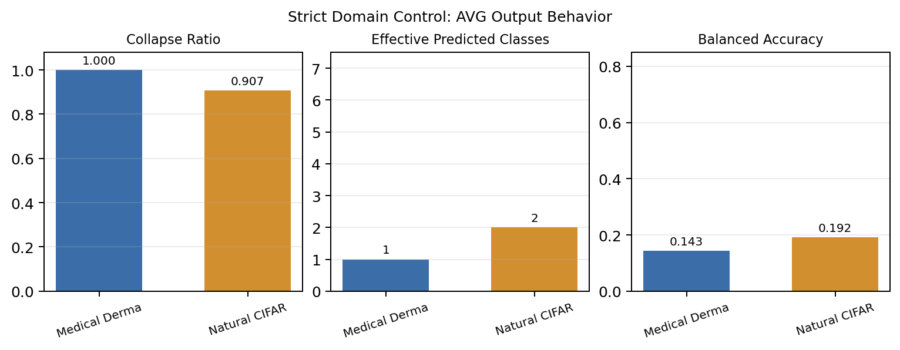
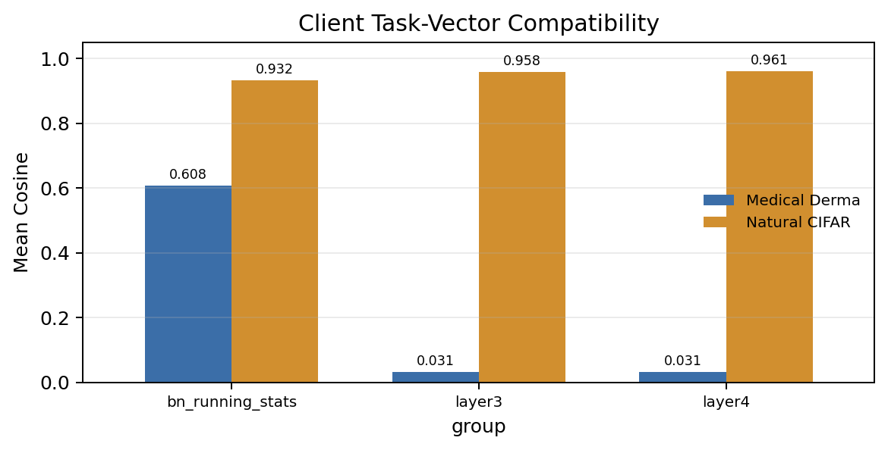
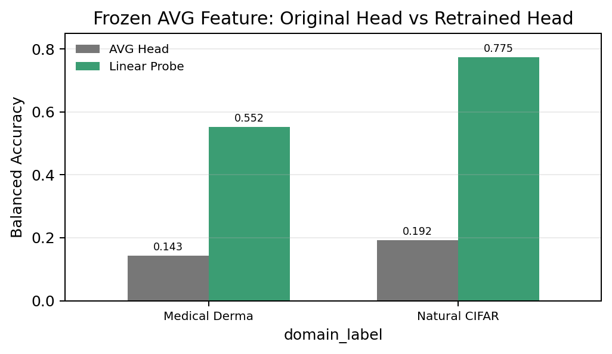

# 严格控制变量：医学图像 vs 自然图像的 AVG 坍缩对照

## 1. 问题

这组实验只回答一个问题：

> 在客户端数量、类别数、类别划分、每类样本数、训练轮数、模型结构、输入尺寸、优化器和融合方法都对齐后，医学图像和自然图像的模型 AVG 坍缩是否仍然不同？

这个实验不是为了证明“自然图像永远不会坍缩”。更精确的目标是检验：

> 同样的极端 partial-label + long-tail 客户端设置，会不会在医学图像上产生更彻底的单类坍缩。

## 2. 严格控制了什么

医学端使用已有 DermaMNIST checkpoint：

```text
model_hub/small/dermamnist_224/resnet/clients_3/beta_0/seed_42
```

自然图像端新建了 `cifar7_derma_strict`，从 CIFAR-10 取 7 个类别，并强行匹配 Derma 的类别数量和客户端分布。

| 变量 | 医学图像 DermaMNIST | 自然图像 CIFAR strict | 是否一致 |
| --- | --- | --- | --- |
| 类别数 | 7 | 7 | 是 |
| train per-class counts | `[228, 359, 769, 80, 779, 4693, 99]` | `[228, 359, 769, 80, 779, 4693, 99]` | 是 |
| val per-class counts | `[33, 52, 110, 12, 111, 671, 14]` | `[33, 52, 110, 12, 111, 671, 14]` | 是 |
| test per-class counts | `[66, 103, 220, 23, 223, 1341, 29]` | `[66, 103, 220, 23, 223, 1341, 29]` | 是 |
| client 0 classes/counts | `3:80, 4:779, 0:228` | `3:80, 4:779, 0:228` | 是 |
| client 1 classes/counts | `2:769, 1:359` | `2:769, 1:359` | 是 |
| client 2 classes/counts | `6:99, 5:4693` | `6:99, 5:4693` | 是 |
| backbone | ResNet | ResNet | 是 |
| input size | 224 | 224 | 是 |
| epochs | 50 | 50 | 是 |
| batch size | 64 | 64 | 是 |
| lr / weight decay | `0.001 / 0.0001` | `0.001 / 0.0001` | 是 |
| pretrained | true | true | 是 |
| merge method | weight AVG | weight AVG | 是 |

唯一有意改变的变量是图像域：一个是医学皮肤镜图像，一个是自然图像。

技术限制：CIFAR-10 单类原始样本数不足以无放回凑出 Derma class 5 的 4693 个 train 样本，所以 `cifar7_derma_strict` 的 class 5 在 train/val/test 都使用了有放回采样。这个限制需要在论文中披露。

## 3. 融合结果



| domain | AVG Acc | AVG BAcc | Macro F1 | Collapse Ratio | Effective Pred Classes | Top Class | Pred Counts |
| --- | ---: | ---: | ---: | ---: | ---: | ---: | --- |
| Medical Derma | 0.668828 | 0.142857 | 0.114508 | 1.000000 | 1 | 5 | `[0, 0, 0, 0, 0, 2005, 0]` |
| Natural CIFAR strict | 0.699252 | 0.191548 | 0.174710 | 0.906733 | 2 | 5 | `[0, 0, 0, 0, 187, 1818, 0]` |

指标解释：

- `Acc`：普通 accuracy。这里会被 class 5 的大测试占比放大。
- `BAcc`：balanced accuracy，每个类别 recall 等权平均。7 类随机/单类预测大约是 `1/7 = 0.142857`。
- `Macro F1`：每类 F1 等权平均，能暴露少数类失败。
- `Collapse Ratio`：预测最多的类别占全部测试样本的比例。
- `Effective Pred Classes`：实际被模型预测到的类别数。

结果读法：

1. 自然图像在完全相同的极端分布下也被 class 5 强烈牵引，`collapse_ratio=0.906733`。
2. 但自然图像没有变成医学那种严格单类分类器；它仍然预测了 187 个 class 4。
3. 医学 Derma AVG 的 BAcc 正好是 `0.142857`，说明它在 7 类任务上退化成“永远预测 class 5”的随机水平单类分类器。

所以严格控制后的结论不是：

```text
自然图像不会坍缩，医学图像才会坍缩。
```

而是：

```text
同样的 partial-label + long-tail 分布会让自然图像也产生强 dominant-class drift；
但医学图像在同样条件下坍缩得更彻底，直接退化为单类预测。
```

## 4. 为什么最后全部选 class 5

模型最终预测某一类，取决于该类 logit 是否最大。对 class 5 和另一个类别 `c`，关键量是：

```text
margin(5,c) = logit_5 - logit_c
            = (w_5 - w_c)^T h + (b_5 - b_c)
```

其中：

- `h` 是 AVG 模型对图像抽出来的最终特征，本来负责表达“这张图像有什么类别证据”。
- `w_c, b_c` 是分类头里第 `c` 类的权重和 bias，本来负责把特征证据读成类别分数。
- 如果 `margin(5,c) > 0`，说明 class 5 分数超过 class `c`。
- 如果 class 5 对所有其他类的 margin 都大于 0，那么 argmax 一定是 class 5。

严格控制结果如下：

| domain | Compare | Mean Delta | P05 Delta | Min Delta | Pct Positive |
| --- | --- | ---: | ---: | ---: | ---: |
| Medical Derma | 5-0 | 1.344966 | 0.635670 | 0.359340 | 1.000000 |
| Medical Derma | 5-1 | 0.997494 | 0.411551 | 0.123354 | 1.000000 |
| Medical Derma | 5-2 | 0.570603 | 0.268922 | 0.133353 | 1.000000 |
| Medical Derma | 5-3 | 1.504307 | 0.381957 | 0.080625 | 1.000000 |
| Medical Derma | 5-4 | 0.727216 | 0.463657 | 0.071431 | 1.000000 |
| Medical Derma | 5-6 | 1.869700 | 0.688538 | 0.283340 | 1.000000 |
| Natural CIFAR strict | 5-4 | 0.342022 | -0.061839 | -0.344914 | 0.906733 |

这张表直接解释了为什么医学 AVG 全部预测 class 5：

> 医学 AVG 的 class 5 margin 对所有竞争类、所有测试样本都是正数，所以任何图像进来，class 5 都赢。

自然图像为什么还有一部分 class 4 能赢？

> 自然图像里 `5-4` 的 margin 有负尾部，`p05=-0.061839`、`min=-0.344914`，所以有些图像的 class 4 分数能超过 class 5。最终它预测了 187 个 class 4，而不是完全单类。

这不是简单的 classifier bias 导致的。以 Derma 为例：

| Compare | Projection Mean | Bias Delta | Total Mean |
| --- | ---: | ---: | ---: |
| 5-2 | 0.566755 | 0.003848 | 0.570603 |
| 5-4 | 0.761412 | -0.034195 | 0.727216 |
| 5-6 | 1.867584 | 0.002116 | 1.869700 |

`bias_delta` 很小，真正决定 class 5 胜出的主要是 `(w_5 - w_c)^T h`。也就是说：

> 融合后的医学特征 `h` 被分类头读出来时，几乎总是落在 class 5 相对其他类别更高的方向上。

## 5. 医学的特异点在哪里



| group | Medical Derma Cosine | Natural CIFAR Cosine |
| --- | ---: | ---: |
| BN running stats | 0.607558 | 0.932364 |
| layer3 | 0.030653 | 0.958356 |
| layer4 | 0.030976 | 0.960622 |

task-vector cosine 的含义：

```text
delta_i = client_i - common_init
cosine(delta_i, delta_j)
```

它衡量不同客户端从同一个初始化模型出发，是否朝相似方向更新。

这里的因果解释可以写成：

> 医学客户端的高层 task vector 变得几乎正交。高层参数本来用来形成类别语义特征；由于不同医学客户端只看见不同类别、且皮肤镜图像的类别边界更弱，它们学到的高层判别方向彼此不兼容。AVG 把这些方向直接平均后，得到的 feature extractor、BN running statistics 和 classifier head 不再配套，最后分类头把多数样本读成 class 5。

自然图像在同样类别数量和样本数量下，layer3/layer4 cosine 仍然接近 0.96。这说明：

> 自然图像客户端虽然也是 partial-label 和 long-tail，但它们的高层更新仍然共享很强的共同方向；AVG 后还保留了更多可被分类头或重训头利用的类别证据。

## 6. 特征不是完全坏掉，而是原头读不出来



| domain | Original AVG Head BAcc | Frozen AVG Feature + Linear Probe BAcc | Effective Pred Classes After Probe |
| --- | ---: | ---: | ---: |
| Medical Derma | 0.142857 | 0.551806 | 7 |
| Natural CIFAR strict | 0.191548 | 0.774773 | 7 |

linear probe 的含义：

1. 冻结 AVG 模型的 feature extractor。
2. 丢掉原来的 AVG classifier head。
3. 只重新训练一个线性分类头。

结果说明：

> 医学 AVG 并不是把所有图像特征完全毁掉了。冻结 AVG feature 后，只重训 linear head，BAcc 可以从 0.142857 恢复到 0.551806，预测类别数也从 1 恢复到 7。

因此最准确的机制不是“融合把医学特征完全破坏了”，而是：

> 医学 AVG 后，feature extractor 里仍有类别信息，但原来的平均分类头和这些特征不匹配；这个不匹配把所有样本的 logit argmax 推向 class 5。

自然图像也有 head-feature mismatch，但它更容易被修复：linear probe BAcc 达到 0.774773。

## 7. 最终结论

严格控制变量后，可以得到三个结论。

第一，强版本命题不成立：

```text
自然图像在同样非IID和样本不均衡下完全不会坍缩。
```

这个说法不成立。严格 CIFAR 也出现了 `collapse_ratio=0.906733` 的强 dominant-class drift。

第二，弱版本命题成立：

```text
在相同 client split、相同每类数量、相同模型和相同训练超参下，
医学图像的 AVG 坍缩更彻底。
```

Derma AVG 是严格单类预测：`effective_pred_classes=1`、`BAcc=0.142857`。严格 CIFAR 仍保留 2 个预测类，且 BAcc 更高。

第三，最可写进论文的机制是：

```text
医学客户端的高层更新方向更不兼容，AVG 后 feature extractor、BN running statistics 和 classifier head 的配套关系被打乱；
同时 AVG feature 在 class 5 相对竞争类的投影 margin 对全部样本为正，
所以分类头把所有输入都读成 class 5。
自然图像在同样长尾 partial-label 压力下也向 class 5 漂移，
但仍有 class 4 的负 margin 尾部，所以没有完全单类化。
```

一句话版本：

> 非IID 和样本不均衡提供了坍缩压力；医学图像的高层表示/分类头不兼容把这种压力放大成严格单类坍缩。

