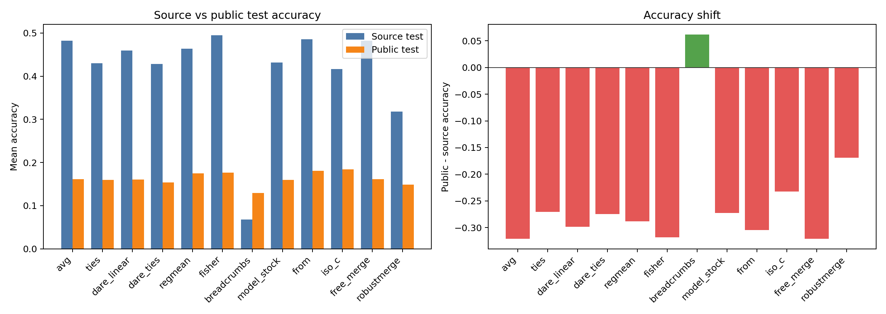

# 汇总表2：公开数据集作为 Test Set

本表使用 `PublicMedFingerprint_data/test` 作为公开测试集。融合/统计数据仍使用源域 `Med_data`，因此这是严格的 public-test evaluation，不让公开 test 图像参与融合统计。

## 实验范围

| 项目 | 设置 |
|---|---|
| 模型 | small / resnet |
| 数据集 | bloodmnist_224, dermamnist_224 |
| 客户端数 | 3 |
| Beta | 0, 0.01, 0.1 |
| Seed | 42 |
| 方法数 | 12 |
| 总 case | 72 |
| 融合/统计数据 | `Med_data` |
| 评估数据 | `PublicMedFingerprint_data/test` |

公开 test 样本数：

| Dataset | Public Test Samples |
|---|---|
| bloodmnist_224 | 1024 |
| dermamnist_224 | 685 |

## 新旧 Test Set 的异同

这里的“旧 test”指源域 `Med_data/test`，也就是训练好客户端和既有 formal accuracy 表使用的 in-domain test set；“新 test”指本次新增的 `PublicMedFingerprint_data/test`，用于模拟同类型公开医学数据上的外部测试。

相同点：

| 维度 | 相同点 |
|---|---|
| 任务类型 | 二者都对应同一个 MedMNIST 子任务：BloodMNIST 或 DermaMNIST。 |
| 类别空间 | 同一数据集的新旧 test 类别 ID 一致；BloodMNIST 都是 8 类，DermaMNIST 都是 7 类。 |
| 输入格式 | 二者都是 `224x224x3` 图像，可直接用同一批已训练客户端和融合模型评估。 |
| 评估对象 | 二者评估的是同一组 `resnet + 3 clients + beta in {0,0.01,0.1} + seed 42 + 12 methods`。 |

不同点：

| 维度 | 旧 test: Med_data/test | 新 test: PublicMedFingerprint_data/test |
|---|---|---|
| 域属性 | 源域 in-domain test，和客户端训练/验证数据来自同一数据资产。 | 外部公开 test，同任务同类别，但不保证采集来源、类别先验、图像风格与源域一致。 |
| 实验角色 | 用来衡量模型在原始源域任务上的性能。 | 用来观察同类型公开数据上是否仍保持相同 accuracy 和方法排名。 |
| 是否参与融合统计 | 本实验中 Fisher/RegMean 等统计型融合仍使用 `Med_data`。 | 严格主实验中不参与融合统计，只参与最终 evaluation。 |
| 类别比例 | 保留源域 test 的原始类别比例，DermaMNIST 明显偏向 class 5。 | BloodMNIST 为均衡 8 类；DermaMNIST 比源域更均衡，class 5 不再占绝对多数。 |
| 可解释含义 | 高分说明模型适配源域。 | 分数和排名大幅变化说明源域适配不等价于外部公开数据鲁棒性。 |

样本数和类别分布：

| Dataset | Old Samples | New Samples | Old Classes | New Classes | Old Shape | New Shape | Old Test Label Counts | New Test Label Counts |
|---|---|---|---|---|---|---|---|---|
| bloodmnist_224 | 3421 | 1024 | 8 | 8 | 224x224x3 | 224x224x3 | 0:244, 1:624, 2:311, 3:579, 4:243, 5:284, 6:666, 7:470 | 0:128, 1:128, 2:128, 3:128, 4:128, 5:128, 6:128, 7:128 |
| dermamnist_224 | 2005 | 685 | 7 | 7 | 224x224x3 | 224x224x3 | 0:66, 1:103, 2:220, 3:23, 4:223, 5:1341, 6:29 | 0:128, 1:128, 2:103, 3:71, 4:81, 5:101, 6:73 |

## 指标定义

| 指标 | 含义 |
|---|---|
| Mean Acc | 该方法在所有 public-test cases 上的 accuracy 平均值。 |
| Median Acc | 该方法在所有 public-test cases 上的 accuracy 中位数。 |
| Mean BAcc | Balanced accuracy，先算每类 recall 再对类别平均。 |
| Mean Macro F1 | Macro F1，先算每类 F1 再对类别平均。 |
| Wins | 每个 setting 内 accuracy 第一的次数；并列第一都计入。 |
| Avg Rank | 每个 setting 内按 accuracy 排名后的平均名次，越小越好；并列使用平均名次。 |
| Low Perf. | `accuracy <= 1 / 类别数 + 0.02` 的 case 比例。 |
| Delta vs Avg | 同一 setting 下 `method_accuracy - avg_accuracy` 的平均值。 |
| Mean Collapse | 预测最多类别占所有预测的比例，越高说明越容易塌缩到少数类别。 |
| Median Eff. Classes | 由预测分布熵换算出的有效预测类别数，中位数越低说明预测类别越单一。 |

## Public-Test 主汇总表

| 方法 | Cases | Mean Acc | Median Acc | Mean BAcc | Mean Macro F1 | Wins | Avg Rank | Low Perf. | Delta vs Avg | Mean Collapse | Median Eff. Classes |
|---|---|---|---|---|---|---|---|---|---|---|---|
| iso_c | 6 | 0.1837 | 0.1896 | 0.1887 | 0.1088 | 2 | 2.67 | 16.7% | +0.0226 | 0.6518 | 2.18 |
| from | 6 | 0.1807 | 0.1511 | 0.1782 | 0.0765 | 1 | 6.67 | 66.7% | +0.0196 | 0.8495 | 1.04 |
| fisher | 6 | 0.1767 | 0.1504 | 0.1709 | 0.0839 | 2 | 6.17 | 33.3% | +0.0156 | 0.8272 | 1.68 |
| regmean | 6 | 0.1751 | 0.1818 | 0.1739 | 0.0961 | 0 | 5.42 | 33.3% | +0.0140 | 0.7149 | 2.13 |
| avg | 6 | 0.1611 | 0.1618 | 0.1624 | 0.0806 | 1 | 6.08 | 50.0% | +0.0000 | 0.8040 | 1.72 |
| free_merge | 6 | 0.1611 | 0.1618 | 0.1624 | 0.0806 | 1 | 6.08 | 50.0% | +0.0000 | 0.8040 | 1.72 |
| dare_linear | 6 | 0.1606 | 0.1591 | 0.1607 | 0.0756 | 0 | 6.42 | 50.0% | -0.0005 | 0.7812 | 1.57 |
| ties | 6 | 0.1594 | 0.1564 | 0.1567 | 0.0745 | 0 | 7.00 | 50.0% | -0.0017 | 0.7621 | 1.86 |
| model_stock | 6 | 0.1593 | 0.1565 | 0.1619 | 0.0772 | 0 | 6.50 | 50.0% | -0.0018 | 0.7779 | 1.50 |
| dare_ties | 6 | 0.1535 | 0.1484 | 0.1507 | 0.0575 | 0 | 8.25 | 66.7% | -0.0076 | 0.8417 | 1.34 |
| robustmerge | 6 | 0.1485 | 0.1477 | 0.1562 | 0.0704 | 0 | 7.75 | 66.7% | -0.0126 | 0.7955 | 1.89 |
| breadcrumbs | 6 | 0.1292 | 0.1187 | 0.1342 | 0.0493 | 0 | 9.00 | 83.3% | -0.0319 | 0.8344 | 1.68 |

## 与源域 Test 的同设置 Accuracy 对照

源域列来自 `results/experiment1/formal_accuracy_rows.csv` 中同样的 `bloodmnist/dermamnist + resnet + c3 + beta in {0,0.01,0.1} + 12 methods`。这里比较的是 accuracy 和 rank；BAcc/Macro F1 只有本次逐样本 public-test 评估中有。

整体平均 accuracy 从源域 test 的 `0.4132` 变为 public test 的 `0.1624`，平均绝对变化为 `0.2665`。6 个 dataset/beta setting 中，top method 切换了 `6/6` 个；平均 rank Spearman 为 `0.013`。

| 方法 | Cases | Source Mean Acc | Public Mean Acc | Public-Source | Mean Abs Shift | Source Wins | Public Wins | Source Avg Rank | Public Avg Rank | Rank Shift |
|---|---|---|---|---|---|---|---|---|---|---|
| avg | 6 | 0.4818 | 0.1611 | -0.3207 | 0.3207 | 0 | 1 | 5.42 | 6.08 | +0.6667 |
| free_merge | 6 | 0.4818 | 0.1611 | -0.3207 | 0.3207 | 0 | 1 | 5.42 | 6.08 | +0.6667 |
| fisher | 6 | 0.4951 | 0.1767 | -0.3184 | 0.3184 | 2 | 2 | 4.75 | 6.17 | +1.4167 |
| from | 6 | 0.4851 | 0.1807 | -0.3044 | 0.3222 | 0 | 1 | 4.83 | 6.67 | +1.8333 |
| dare_linear | 6 | 0.4594 | 0.1606 | -0.2988 | 0.2988 | 1 | 0 | 6.00 | 6.42 | +0.4167 |
| regmean | 6 | 0.4636 | 0.1751 | -0.2885 | 0.2885 | 2 | 0 | 4.83 | 5.42 | +0.5833 |
| dare_ties | 6 | 0.4284 | 0.1535 | -0.2750 | 0.2750 | 0 | 0 | 5.58 | 8.25 | +2.6667 |
| model_stock | 6 | 0.4318 | 0.1593 | -0.2725 | 0.2832 | 0 | 0 | 8.00 | 6.50 | -1.5000 |
| ties | 6 | 0.4298 | 0.1594 | -0.2704 | 0.2704 | 0 | 0 | 8.17 | 7.00 | -1.1667 |
| iso_c | 6 | 0.4163 | 0.1837 | -0.2327 | 0.2327 | 0 | 2 | 6.83 | 2.67 | -4.1667 |
| robustmerge | 6 | 0.3178 | 0.1485 | -0.1693 | 0.2053 | 1 | 0 | 6.17 | 7.75 | +1.5833 |
| breadcrumbs | 6 | 0.0675 | 0.1292 | +0.0617 | 0.0617 | 0 | 0 | 12.00 | 9.00 | -3.0000 |

## 每个 Setting 的 Top Method 切换

| Dataset | Beta | Source Best | Source Best Acc | Public Best | Public Best Acc | Best Changed | Mean Acc Shift | Rank Spearman |
|---|---|---|---|---|---|---|---|---|
| bloodmnist | 0 | regmean | 0.3826 | fisher | 0.2363 | yes | -0.1609 | 0.379 |
| bloodmnist | 0.01 | dare_linear | 0.3376 | iso_c | 0.2012 | yes | -0.1255 | 0.158 |
| bloodmnist | 0.1 | robustmerge | 0.3964 | from | 0.3311 | yes | -0.0990 | -0.074 |
| dermamnist | 0 | fisher | 0.6718 | iso_c | 0.1781 | yes | -0.3717 | 0.219 |
| dermamnist | 0.01 | fisher | 0.6708 | avg,free_merge | 0.1898 | yes | -0.2996 | -0.162 |
| dermamnist | 0.1 | regmean | 0.6808 | fisher | 0.2292 | yes | -0.4483 | -0.439 |

## 辅助检查：Public 图像参与统计会怎样

我还保留了第一版结果在 `results/experiment5_public_test_summary2_public_stats_leakage/`。那一版 `--data-root` 直接指向 public root，导致 Fisher/RegMean 的统计也看到了 public 数据，因此不作为主结论，只用来检查数据依赖方法对统计来源的敏感性。

| 方法 | Cases | Strict Public-Test Acc | Public-Stats Acc | PublicStats-Strict | Max Abs Diff |
|---|---|---|---|---|---|
| regmean | 6 | 0.1751 | 0.1630 | -0.0121 | 0.0752 |
| fisher | 6 | 0.1767 | 0.1725 | -0.0042 | 0.0957 |

## 图

